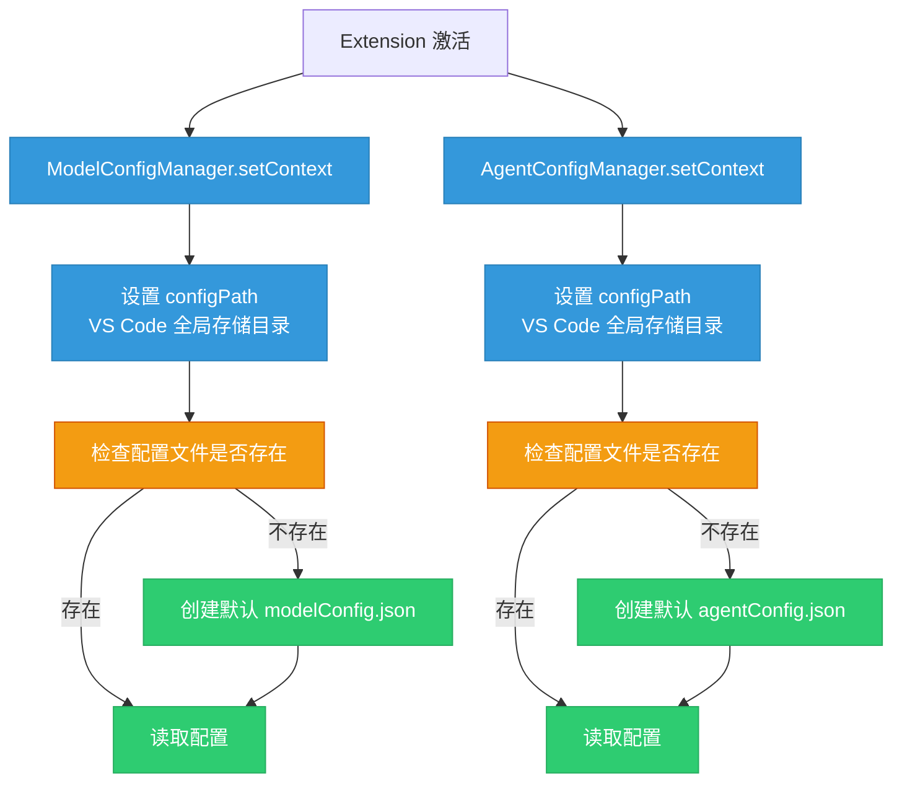
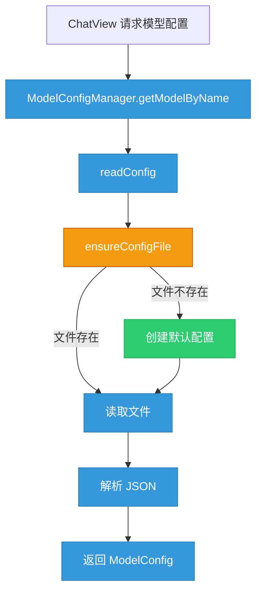
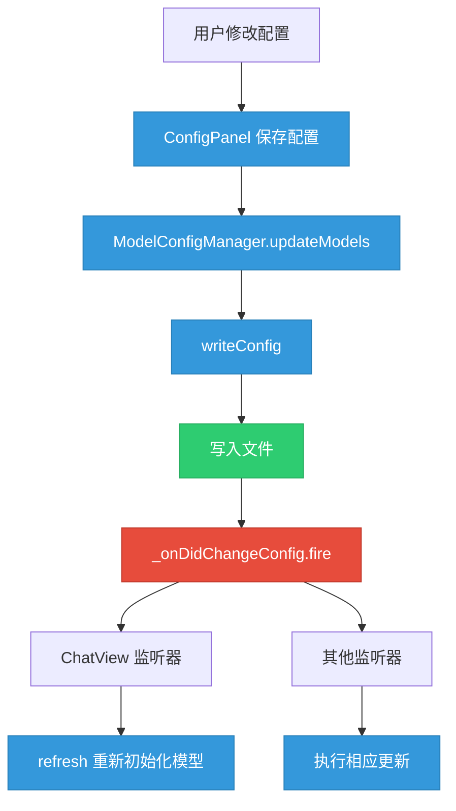
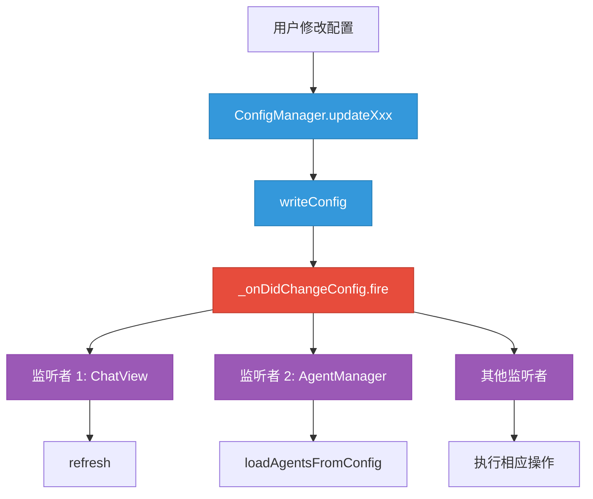

# AI Agent LeoBot 配置文件架构

**最后更新**：2026-04-13  
**状态**：✅ 已实现

---

## 📋 目录

1. [配置文件概述](#配置文件概述)
2. [配置文件结构](#配置文件结构)
3. [配置管理器](#配置管理器)
4. [数据流图](#数据流图)
5. [配置存储位置](#配置存储位置)
6. [安全机制](#安全机制)
7. [事件驱动机制](#事件驱动机制)
8. [待优化设计](#待优化设计) ⭐ 新增

---

## 配置文件概述

### 配置文件列表

#### 当前配置文件（✅ 已实现）

| 文件                 | 用途       | 管理器                  | 存储位置           |
| ------------------ | -------- | -------------------- | -------------- |
| `modelConfig.json` | 模型配置     | `ModelConfigManager` | VS Code 全局存储目录 |
| `agentConfig.json` | Agent 配置 | `AgentConfigManager` | VS Code 全局存储目录 |
| `globalConfig.json` | 全局运行时配置 | `GlobalConfigManager` | VS Code 全局存储目录 |

### 设计原则

- ✅ **配置管理分离** - 模型配置和 Agent 配置独立管理
- ✅ **单一数据源** - 配置文件是唯一的配置数据来源
- ✅ **安全存储** - API Key 使用加密存储
- ✅ **事件驱动** - 配置变化自动通知相关组件
- ✅ **按需加载** - 配置数据按需读取，避免内存浪费

***

## 配置文件结构

### 1. modelConfig.json

**用途**：管理所有 AI 模型的配置信息（⚠️ 部分字段计划迁移到 `globalConfig.json`）

**结构**（当前版本）：

```json
{
  "models": [
    {
      "id": "硅基流动",
      "protocolType": "openai",
      "endpoint": "https://api.siliconflow.cn/v1",
      "apiKey": "加密后的 API Key",
      "modelId": "Qwen/Qwen3.5-122B-A10B"
    },
    {
      "id": "Gemini",
      "protocolType": "gemini",
      "endpoint": "https://generativelanguage.googleapis.com/v1beta",
      "apiKey": "加密后的 API Key",
      "modelId": "gemini-1.5-pro"
    }
  ],
  "defaultModel": "硅基流动",
  "currentAgent": "default",        // ⚠️ 计划迁移到 globalConfig.json
  "agentModels": [],                // ⚠️ 计划迁移到 globalConfig.json
  "agentModeEnabled": true          // ⚠️ 计划迁移到 globalConfig.json
}
```

**结构**（计划优化后）：

```json
{
  "models": [
    {
      "id": "硅基流动",
      "protocolType": "openai",
      "endpoint": "https://api.siliconflow.cn/v1",
      "apiKey": "加密后的 API Key",
      "modelId": "Qwen/Qwen3.5-122B-A10B"
    }
  ],
  "defaultModel": "硅基流动"
  // ✅ currentAgent、agentModels、agentModeEnabled 迁移到 globalConfig.json
}
```

**字段说明**：

| 字段                 | 类型                   | 必填 | 状态       | 说明                     |
| ------------------ | -------------------- | -- | -------- | ---------------------- |
| `models`           | `ModelConfig[]`      | ✅  | 保留       | 模型配置列表                 |
| `defaultModel`     | `string`             | ✅  | 保留       | 默认使用的模型 ID             |
| ~~`currentAgent`~~     | `string`             | ✅  | ⚠️ 计划迁移 | 当前激活的 Agent ID         |
| ~~`agentModels`~~      | `AgentModelConfig[]` | ✅  | ⚠️ 计划迁移 | Agent 与模型的关联配置         |
| ~~`agentModeEnabled`~~ | `boolean`            | ❌  | ⚠️ 计划迁移 | 是否启用 Agent 模式（默认 true） |

**ModelConfig 接口**：

```typescript
interface ModelConfig {
  id: string;                              // 模型配置的别名（用户自定义）
  protocolType: 'openai' | 'anthropic' | 'ollama' | 'gemini' | 'custom';
  apiKey?: string;                         // 加密存储
  endpoint?: string;                       // API 端点 URL
  modelId?: string;                        // 真正的模型名称（发送给 API 用）
}
```

**示例配置**：

```json
{
  "models": [
    {
      "id": "硅基流动",
      "protocolType": "openai",
      "endpoint": "https://api.siliconflow.cn/v1",
      "apiKey": "encrypted:xxxxx",
      "modelId": "Qwen/Qwen3.5-122B-A10B"
    }
  ],
  "defaultModel": "硅基流动",
  "currentAgent": "default",
  "agentModels": [],
  "agentModeEnabled": true
}
```

***

### 2. agentConfig.json

**用途**：管理所有 AI Agent 的配置信息

**结构**：

```json
{
  "agents": [
    {
      "id": "default",
      "name": "默认助手",
      "description": "默认的 AI 助手",
      "systemPrompt": "你是一个有帮助的 AI 助手...",
      "tools": [],
      "modelConfigId": "default"
    },
    {
      "id": "code-reviewer",
      "name": "代码审查员",
      "description": "专注于代码审查和优化",
      "systemPrompt": "你是一位经验丰富的代码审查专家...",
      "tools": ["read_file", "write_file"],
      "modelConfigId": "硅基流动"
    }
  ],
  "defaultAgent": "default"
}
```

**字段说明**：

| 字段             | 类型              | 必填 | 说明             |
| -------------- | --------------- | -- | -------------- |
| `agents`       | `AgentConfig[]` | ✅  | Agent 配置列表     |
| `defaultAgent` | `string`        | ✅  | 默认使用的 Agent ID |

**AgentConfig 接口**：

```typescript
interface AgentConfig {
  id: string;                    // Agent 唯一标识
  name: string;                  // Agent 显示名称
  description: string;           // Agent 描述
  systemPrompt: string;          // 系统提示词（从 media/system_prompt.md 读取）
  tools: string[];               // 启用的工具列表
  modelConfigId?: string;        // 关联的模型配置 ID（'default' 表示使用 defaultModel）
}
```

**特殊处理**：

- `modelConfigId: 'default'` - 动态关联到 `modelConfig.json` 的 `defaultModel`
- `systemPrompt` - 默认从 `media/system_prompt.md` 读取，也可自定义

**示例配置**：

```json
{
  "agents": [
    {
      "id": "default",
      "name": "默认助手",
      "description": "默认的 AI 助手",
      "systemPrompt": "你是一个有帮助的 AI 助手，擅长回答用户的问题。",
      "tools": [],
      "modelConfigId": "default"
    }
  ],
  "defaultAgent": "default"
}
```

***

### 3. globalConfig.json

**用途**：管理全局运行时配置信息（✅ 已实现）

**结构**：

```json
{
  "currentAgent": "default",
  "agentModels": [],
  "agentModeEnabled": true
}
```

**字段说明**：

| 字段 | 类型 | 必填 | 说明 |
| --- | --- | --- | --- |
| `currentAgent` | `string` | ✅ | 当前激活的 Agent ID |
| `agentModels` | `AgentModelConfig[]` | ✅ | Agent 与模型的关联配置 |
| `agentModeEnabled` | `boolean` | ❌ | 是否启用 Agent 模式（默认 true） |

**迁移说明**：

- 这些字段原本在 `modelConfig.json` 中，现已迁移到独立的 `globalConfig.json`
- 分离静态配置（模型定义）和动态配置（运行时设置）
- 通过 `ConfigMigrationTool` 自动迁移旧配置

***

## 配置管理器

### 1. ModelConfigManager

**职责**：管理 `modelConfig.json` 的 CRUD 操作

**单例模式**：

```typescript
export class ModelConfigManager {
  private static instance: ModelConfigManager;
  
  static getInstance(): ModelConfigManager {
    if (!ModelConfigManager.instance) {
      ModelConfigManager.instance = new ModelConfigManager();
    }
    return ModelConfigManager.instance;
  }
}
```

**核心方法**：

| 方法                                | 返回值                            | 说明               |
| --------------------------------- | ------------------------------ | ---------------- |
| `setContext(context)`             | `void`                         | 初始化 VS Code 上下文  |
| `getModels()`                     | `ModelConfig[]`                | 获取所有模型配置         |
| `updateModels(models)`            | `Promise<void>`                | 更新模型配置列表         |
| `getDefaultModel()`               | `string`                       | 获取默认模型 ID        |
| `setDefaultModel(modelName)`      | `Promise<void>`                | 设置默认模型           |
| `getApiKey(modelName)`            | `Promise<string \| undefined>` | 获取解密的 API Key    |
| `updateApiKey(modelName, apiKey)` | `Promise<void>`                | 更新加密的 API Key    |
| `getModelByName(name)`            | `ModelConfig \| undefined`     | 根据名称获取模型配置       |
| `getCurrentAgentAndModel()`       | `Promise<...>`                 | 获取当前 Agent 和模型信息 |

**事件驱动**：

```typescript
private _onDidChangeConfig = new vscode.EventEmitter<void>();
public readonly onDidChangeConfig = this._onDidChangeConfig.event;

// 配置变化时触发事件
async updateModels(models: ModelConfig[]): Promise<void> {
  const config = this.readConfig();
  config.models = models;
  this.writeConfig(config);
  this._onDidChangeConfig.fire();  // ✅ 通知监听者
}
```

**监听者**：

- `ChatView` - 监听配置变化，重新初始化模型
- `ConfigPanel` - 监听配置变化，刷新 UI

***

### 2. AgentConfigManager

**职责**：管理 `agentConfig.json` 的 CRUD 操作

**单例模式**：

```typescript
export class AgentConfigManager {
  private static instance: AgentConfigManager;
  
  static getInstance(): AgentConfigManager {
    if (!AgentConfigManager.instance) {
      AgentConfigManager.instance = new AgentConfigManager();
    }
    return AgentConfigManager.instance;
  }
}
```

**核心方法**：

| 方法                         | 返回值                        | 说明                                 |
| -------------------------- | -------------------------- | ---------------------------------- |
| `setContext(context)`      | `void`                     | 初始化 VS Code 上下文                    |
| `getDefaultSystemPrompt()` | `string`                   | 从 `media/system_prompt.md` 读取默认提示词 |
| `getAgents()`              | `AgentConfig[]`            | 获取所有 Agent 配置                      |
| `updateAgents(agents)`     | `Promise<void>`            | 更新 Agent 配置列表                      |
| `getAgentById(id)`         | `AgentConfig \| undefined` | 根据 ID 获取 Agent 配置                  |
| `addAgent(agent)`          | `Promise<void>`            | 添加新 Agent                          |
| `updateAgent(agent)`       | `Promise<void>`            | 更新 Agent 配置                        |
| `removeAgent(id)`          | `Promise<void>`            | 删除 Agent                           |
| `getDefaultAgent()`        | `string`                   | 获取默认 Agent ID                      |

**特殊功能**：

```typescript
// 处理 modelId 为 'default' 的情况
getAgents(): AgentConfig[] {
  const config = this.readConfig();
  const agents = config.agents || [];
  
  // 动态关联到 modelConfig.json 的 defaultModel
  const modelConfigManager = ModelConfigManager.getInstance();
  const defaultModel = modelConfigManager.getDefaultModel();
  
  return agents.map(agent => {
    if (agent.modelConfigId === 'default') {
      return { ...agent, modelId: defaultModel };
    }
    return agent;
  });
}
```

**事件驱动**：

```typescript
private _onDidChangeConfig = new vscode.EventEmitter<void>();
public readonly onDidChangeConfig = this._onDidChangeConfig.event;

// 配置变化时触发事件
async updateAgents(agents: AgentConfig[]): Promise<void> {
  const config = this.readConfig();
  config.agents = agents;
  this.writeConfig(config);
  this._onDidChangeConfig.fire();  // ✅ 通知监听者
}
```

**监听者**：

- `AgentManager` - 监听配置变化，重新加载 Agent 缓存

***

## 数据流图

### 配置初始化流程



### 配置读取流程



### 配置更新流程（带事件通知）



***

## 配置存储位置

### VS Code 全局存储目录

**Windows**：

```
%APPDATA%\Code\User\globalStorage\<extension-id>\
  ├── modelConfig.json
  └── agentConfig.json
```

**macOS**：

```
~/Library/Application Support/Code/User/globalStorage/<extension-id>/
  ├── modelConfig.json
  └── agentConfig.json
```

**Linux**：

```
~/.config/Code/User/globalStorage/<extension-id>/
  ├── modelConfig.json
  └── agentConfig.json
```

**获取方式**：

```typescript
setContext(context: vscode.ExtensionContext) {
  this._context = context;
  // 使用 VS Code 的全局存储目录
  this.configPath = path.join(context.globalStorageUri.fsPath, CONFIG_FILE_NAME);
}
```

**优势**：

- ✅ 用户数据与插件分离
- ✅ 支持多工作区共享配置
- ✅ VS Code 自动管理备份和同步
- ✅ 卸载插件时可选择保留配置

***

## 安全机制

### API Key 加密存储

**加密流程**：


**加密实现**：

```typescript
// crypto.ts
import * as crypto from 'crypto';

export async function encrypt(
  plainText: string, 
  context: vscode.ExtensionContext
): Promise<string> {
  // 使用 VS Code 的 secretStorage API 安全存储密钥
  const secretKey = await context.secrets.get('encryption-key');
  if (!secretKey) {
    // 生成随机密钥
    const key = crypto.randomBytes(32).toString('hex');
    await context.secrets.store('encryption-key', key);
  }
  
  // 使用 AES-256-GCM 加密
  const iv = crypto.randomBytes(16);
  const cipher = crypto.createCipheriv('aes-256-gcm', Buffer.from(secretKey, 'hex'), iv);
  
  let encrypted = cipher.update(plainText, 'utf8', 'hex');
  encrypted += cipher.final('hex');
  
  const authTag = cipher.getAuthTag().toString('hex');
  
  return JSON.stringify({
    encrypted,
    iv: iv.toString('hex'),
    authTag
  });
}

export async function decrypt(
  encryptedText: string, 
  context: vscode.ExtensionContext
): Promise<string> {
  const secretKey = await context.secrets.get('encryption-key');
  const { encrypted, iv, authTag } = JSON.parse(encryptedText);
  
  const decipher = crypto.createDecipheriv(
    'aes-256-gcm',
    Buffer.from(secretKey, 'hex'),
    Buffer.from(iv, 'hex')
  );
  
  decipher.setAuthTag(Buffer.from(authTag, 'hex'));
  
  let decrypted = decipher.update(encrypted, 'hex', 'utf8');
  decrypted += decipher.final('utf8');
  
  return decrypted;
}
```

**使用示例**：

```typescript
// ModelConfigManager.ts
async getApiKey(modelName: string): Promise<string | undefined> {
  const models = this.getModels();
  const model = models.find(m => m.id === modelName);
  
  if (model?.apiKey) {
    if (!this._context) {
      Logger.error('Context 未初始化，无法解密 API Key');
      return model.apiKey; // 返回加密文本（兼容模式）
    }
    try {
      return await decrypt(model.apiKey, this._context);
    } catch (error: any) {
      Logger.error('解密 API Key 失败', error);
      return model.apiKey; // 解密失败则返回原文（兼容旧数据）
    }
  }
  return undefined;
}

async updateApiKey(modelName: string, apiKey: string): Promise<void> {
  const models = this.getModels();
  const modelIndex = models.findIndex(m => m.id === modelName);
  
  if (modelIndex !== -1) {
    if (!this._context) {
      Logger.error('Context 未初始化，无法加密 API Key');
      models[modelIndex].apiKey = apiKey; // 直接保存明文（兼容模式）
    } else {
      const encryptedKey = await encrypt(apiKey, this._context);
      models[modelIndex].apiKey = encryptedKey;
    }
    await this.updateModels(models);
  }
}
```

***

## 事件驱动机制

### 事件类型

| 事件                                     | 触发时机       | 监听者                      |
| -------------------------------------- | ---------- | ------------------------ |
| `ModelConfigManager.onDidChangeConfig` | 模型配置变化     | `ChatView`、`ConfigPanel` |
| `AgentConfigManager.onDidChangeConfig` | Agent 配置变化 | `AgentManager`           |

### 事件监听示例

**ChatView 监听模型配置变化**：

```typescript
// ChatView.ts
export class ChatViewProvider {
  constructor(
    private readonly _extensionPath: string,
    private readonly _configManager: ModelConfigManager
  ) {
    // 监听配置变化事件，自动重新初始化模型
    this._configManager.onDidChangeConfig(() => {
      Logger.info('检测到模型配置变化，重新初始化模型');
      this.refresh();
    });
  }
  
  public async refresh() {
    // 重新初始化模型适配器
    await this._initializeModel();
  }
}
```

**AgentManager 监听 Agent 配置变化**：

```typescript
// AgentManager.ts
export class AgentManager {
  setAgentConfigManager(configManager: AgentConfigManager) {
    this.agentConfigManager = configManager;
    this.loadAgentsFromConfig();
    
    // 监听配置变化事件，自动重新加载 Agent
    this.configChangeListener = configManager.onDidChangeConfig(() => {
      Logger.info('检测到 Agent 配置变化，重新加载 Agent');
      this.loadAgentsFromConfig();
    });
  }
}
```

### 事件流程图



***

## 8. 已完成的优化设计 ⭐

### globalConfig.json 独立方案（✅ 已完成）

#### 背景

当前 `modelConfig.json` 包含了两类配置：
1. **静态配置** - 模型定义（`models` 数组）
2. **动态配置** - 运行时设置（`currentAgent`、`agentModels`、`agentModeEnabled`）

#### 优化方案

将动态配置独立到 `globalConfig.json` 文件中：

**优化前结构**：
```json
// modelConfig.json
{
  "models": [...],              // 静态配置
  "defaultModel": "硅基流动",    // 静态配置
  "currentAgent": "default",    // ⚠️ 动态配置（已迁移）
  "agentModels": [],            // ⚠️ 动态配置（已迁移）
  "agentModeEnabled": true      // ⚠️ 动态配置（已迁移）
}
```

**优化后结构**：
```json
// modelConfig.json
{
  "models": [...],
  "defaultModel": "硅基流动"
}

// globalConfig.json ⭐ 新增
{
  "currentAgent": "default",
  "agentModels": [],
  "agentModeEnabled": true
}
```

#### 优势

| 优势 | 说明 |
|------|------|
| ✅ **职责分离** | `modelConfig.json` 专注模型定义，`globalConfig.json` 专注运行时设置 |
| ✅ **减少耦合** | 切换运行时配置不需要修改模型定义 |
| ✅ **配置分层** | 静态配置（稳定）vs 动态配置（频繁变化） |
| ✅ **易于扩展** | 可添加更多全局设置（主题、语言等） |

#### 实施细节

1. **创建 `GlobalConfigManager`** ✅
   - 单例模式管理全局运行时配置
   - 提供 `getCurrentAgent()`、`setCurrentAgent()` 等方法
   - 支持事件驱动机制 `onDidChangeConfig`

2. **迁移配置数据** ✅
   - 通过 `ConfigMigrationTool` 自动检测并迁移旧配置
   - 从 `modelConfig.json` 读取运行时配置字段
   - 写入到新的 `globalConfig.json`
   - 删除 `modelConfig.json` 中的已迁移字段

3. **更新依赖代码** ✅
   - `ModelConfigManager` - 移除运行时配置相关方法
   - `ChatView` - 从 `GlobalConfigManager` 获取运行时配置
   - `configManager` - 代理到 `GlobalConfigManager`

4. **向后兼容** ✅
   - 自动检测旧配置文件格式
   - 启动时自动迁移配置到新格式
   - 提供回滚功能（`ConfigMigrationTool.rollback`）

#### 实现文件

| 文件 | 说明 |
|------|------|
| `src/managers/GlobalConfigManager.ts` | 全局运行时配置管理器 |
| `src/utils/ConfigMigrationTool.ts` | 配置迁移工具 |
| `src/extension.ts` | 集成配置迁移逻辑 |
| `src/features/ChatView.ts` | 使用 GlobalConfigManager |
| `src/managers/ModelConfigManager.ts` | 移除运行时配置字段 |

---

## 📝 总结

### 架构优势

| 优势           | 说明                                               |
| ------------ | ------------------------------------------------ |
| ✅ **配置管理分离** | `ModelConfigManager` 和 `AgentConfigManager` 独立管理 |
| ✅ **单一数据源**  | 配置文件是唯一的配置数据来源                                   |
| ✅ **安全存储**   | API Key 使用 AES-256-GCM 加密存储                      |
| ✅ **事件驱动**   | 配置变化自动通知相关组件                                     |
| ✅ **按需加载**   | 配置数据按需读取，避免内存浪费                                  |
| ✅ **单例模式**   | 确保配置管理器全局唯一                                      |
| ✅ **错误处理**   | 完善的错误处理和日志记录                                     |

### 配置文件对比

| 特性       | modelConfig.json     | agentConfig.json     |
| -------- | -------------------- | -------------------- |
| **用途**   | 模型配置管理               | Agent 配置管理           |
| **管理器**  | `ModelConfigManager` | `AgentConfigManager` |
| **存储位置** | VS Code 全局存储目录       | VS Code 全局存储目录       |
| **加密**   | API Key 加密           | 无加密                  |
| **事件**   | ✅                    | ✅                    |
| **默认值**  | ✅ 自动创建               | ✅ 自动创建               |

### 待改进方向

| 改进 | 优先级 | 状态 | 说明 |
|------|--------|------|------|
| ~~创建 `globalConfig.json`~~ | 🔴 高 | ✅ 已完成 | 将运行时配置独立到新文件 |
| ~~创建 `GlobalConfigManager`~~ | 🔴 高 | ✅ 已完成 | 管理全局运行时配置 |
| ~~配置迁移工具~~ | 🟡 中 | ✅ 已完成 | 自动迁移旧配置到新格式 |
| 配置版本管理 | 🟡 中 | ⏳ 待实施 | 支持配置回滚和历史记录 |
| 配置同步 | 🟡 中 | ⏳ 待实施 | 支持多设备配置同步 |
| 配置验证 | 🟢 低 | ⏳ 待实施 | 添加配置 schema 验证 |

***

**文档结束**
