# AI Agent LeoBot 项目分析

## 项目概述

AI Agent LeoBot 是一个运行在 VS Code 中的本地 AI Agent 运行时扩展，支持多模型编排和 MCP 工具调用。

**核心特性**：
- ✅ Agent 模式：支持多个 Agent 配置和切换
- ✅ MCP 工具调用：内置文件操作工具（read_file, write_file 等）
- ✅ 多模型支持：Gemini、OpenAI 协议、硅基流动等
- ✅ 配置管理：模型配置和 Agent 配置分离
- ✅ 统一日志：LogOutputChannel 输出到 VS Code 输出面板

---

## 1. 系统架构图（计划中 - 2026-04-12）

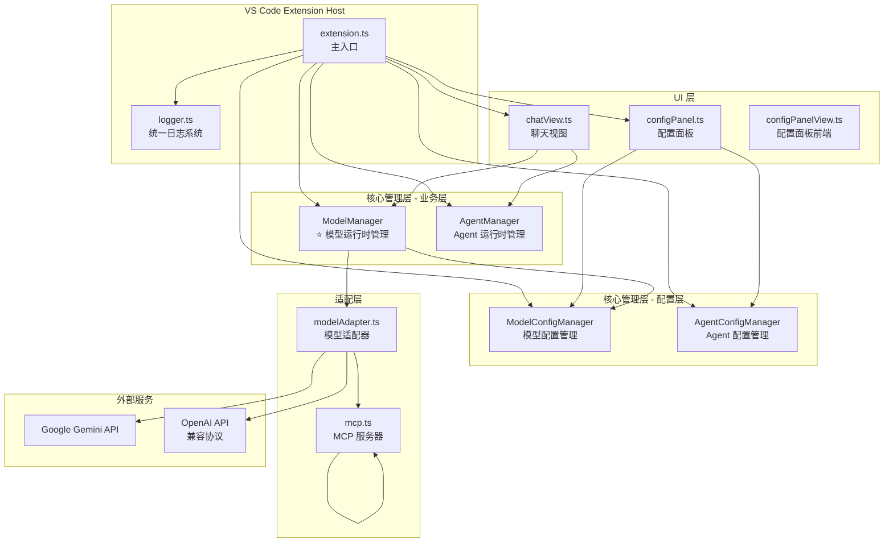

**关键架构决策**：

- ✅ **配置管理分离** - `ModelConfigManager` 管理模型配置，`AgentConfigManager` 管理 Agent 配置
- ✅ **职责分离** - `AgentConfigManager` 负责文件 I/O，`AgentManager` 负责运行时逻辑
- ✅ **配置层不依赖业务层** - `ModelConfigManager` 不再调用 `AgentManager`（已修复）
- ✅ **单一数据源** - 系统提示词只存储在 `media/system_prompt.md`
- ⭐ **新增 ModelManager** - 统一管理模型运行时（计划中）
  - 管理 ModelAdapter 的创建和缓存
  - 提供统一的模型访问接口
  - 处理模型切换
  - 提供模型变化通知（事件驱动）
- ✅ **事件驱动** - 配置变化时通过事件通知相关组件（待实现）
- ✅ **MCP 内置工具** - MCPServer 直接内置工具处理器，不依赖外部 Skill 系统

## 2. 模块依赖关系图（计划中 - 2026-04-12）

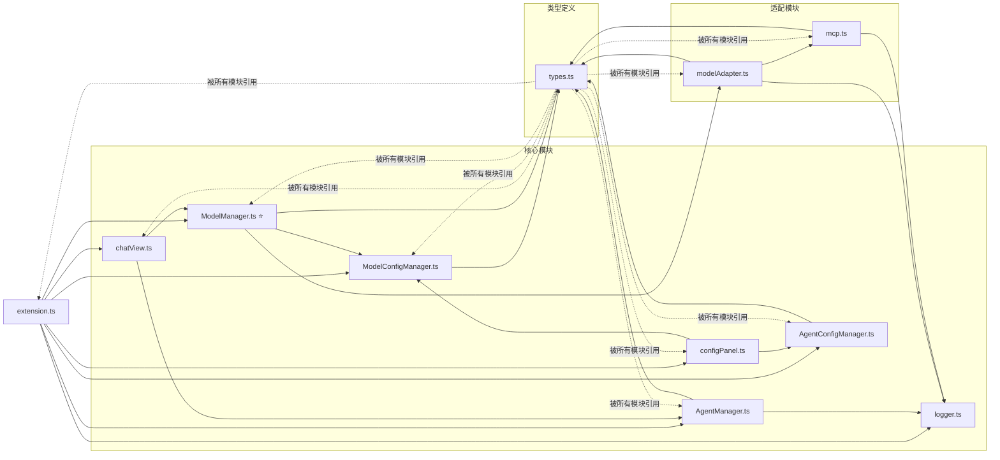

**依赖关系说明**：

### ✅ 配置层（最底层 - 不依赖其他 Manager）
- `ModelConfigManager` - 管理 `modelConfig.json`，只依赖 Types
- `AgentConfigManager` - 管理 `agentConfig.json`，只依赖 Types
- ✅ **配置层独立** - 不依赖业务层，符合单一职责原则

### ✅ 业务层（中间层 - 依赖配置层）
- `ModelManager` ⭐ - 管理模型运行时，依赖 `ModelConfigManager`
- `AgentManager` - 管理 Agent 运行时，依赖 `AgentConfigManager`
- ✅ **业务层依赖配置层** - 读取配置数据
- ✅ **业务层之间解耦** - `ModelManager` 和 `AgentManager` 互不依赖

### ✅ 适配器层（工具层 - 独立）
- `ModelAdapter` - 模型适配器，不依赖任何 Manager
- `MCPServer` - MCP 服务器，不依赖任何 Manager
- ✅ **适配器层独立** - 只通过构造函数接收配置

### ✅ 已修复
- ✅ ~~`ModelConfigManager.getAllAgents()` 方法调用了 `agentManager`~~ - 已移除（2026-04-12）
- ⚠️ 配置层和业务层之间没有事件机制 - 应该添加观察者模式

## 3. 数据流图（实际情况 - 2026-04-12 更新）

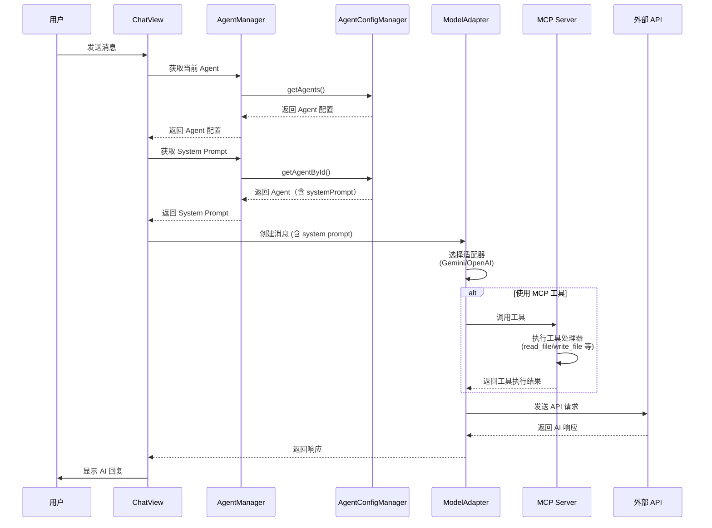

**关键数据流说明**：

### ✅ 配置读取流程
```
ChatView
  ↓ getCurrentAgent()
AgentManager
  ↓ getAgents()
AgentConfigManager
  ↓ readConfig() 读取 agentConfig.json
文件系统
  ↓ 返回配置
AgentConfigManager → AgentManager → ChatView
```

### ✅ 系统提示词来源
```
media/system_prompt.md (唯一数据源)
  ↓ 读取一次（启动时）
AgentConfigManager.getDefaultSystemPrompt()
  ↓ 写入
agentConfig.json (配置文件)
  ↓ 每次读取
AgentConfigManager.getAgents()
  ↓ 返回
AgentManager → ChatView → ModelAdapter
```

### ✅ MCP 工具调用流程
```
ModelAdapter.chat()
  ↓ 检测到工具调用
MCPServer.executeTool()
  ↓ 执行内置工具
read_file / write_file / list_directory 等
  ↓ 返回结果
ModelAdapter → ChatView
```

### ❌ 待改进
- ⚠️ 配置变化时没有自动通知机制 - 应该添加事件驱动
- ⚠️ `AgentManager` 缓存所有 Agent - 应该按需读取

## 4. 配置管理流程图（实际情况）

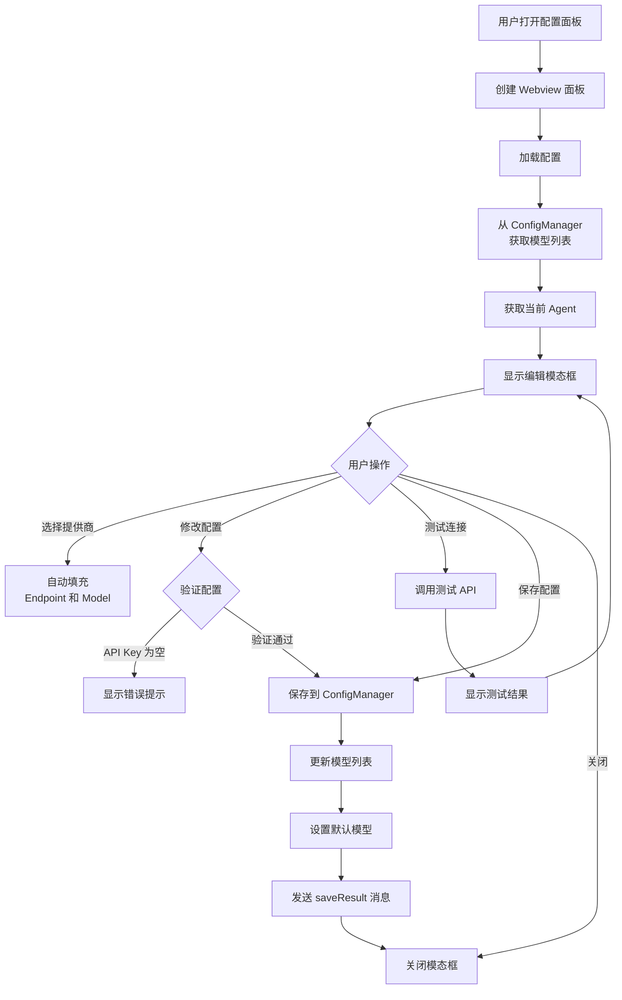

## 5. Agent 管理系统图（实际情况 - 2026-04-12 更新）

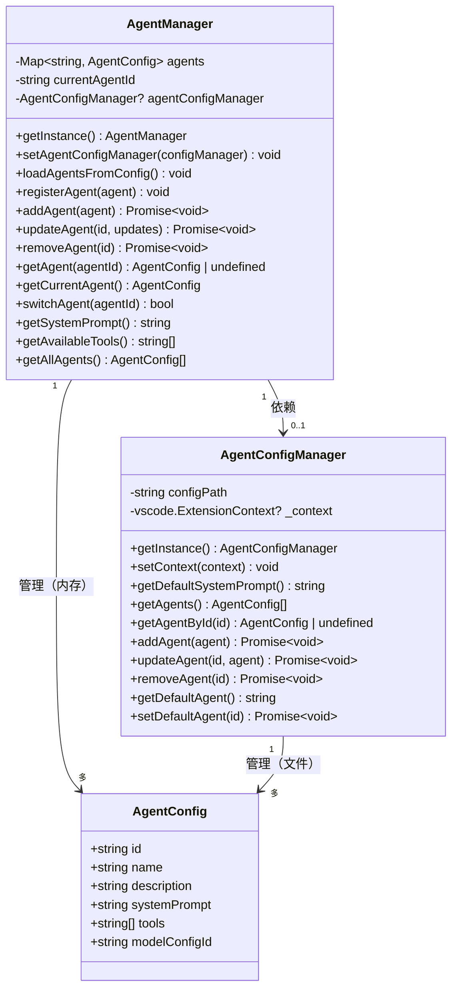

**职责划分**：

### ✅ AgentConfigManager（配置层）
- **职责**：管理 `agentConfig.json` 文件
- **方法**：
  - `getDefaultSystemPrompt()` - 从 `media/system_prompt.md` 读取
  - `getAgents()` - 读取配置文件，返回所有 Agent
  - `getAgentById(id)` - 读取指定 Agent
  - `addAgent()`, `updateAgent()`, `removeAgent()` - CRUD 操作
- **特点**：
  - ✅ 只依赖文件系统
  - ✅ 不依赖其他 Manager
  - ✅ 单一数据源（media/system_prompt.md）

### ✅ AgentManager（业务层）
- **职责**：管理 Agent 运行时
- **方法**：
  - `getCurrentAgent()` - 获取当前激活的 Agent
  - `getSystemPrompt()` - 获取当前系统提示词
  - `getAvailableTools()` - 获取工具列表
  - `switchAgent()` - 切换 Agent
  - `addAgent()`, `updateAgent()`, `removeAgent()` - 业务操作
- **特点**：
  - ✅ 依赖 `AgentConfigManager` 获取配置
  - ✅ 管理内存中的 Agent 缓存
  - ✅ 提供运行时 API

### ❌ 待改进
- ⚠️ `AgentManager` 缓存所有 Agent - 内存浪费
- ⚠️ 没有事件机制 - 配置变化时无法自动同步
- ⚠️ `registerDefaultAgents()` 方法冗余 - 应该直接调用 `AgentConfigManager`

## 6. 模型适配器模式图（实际情况 - 2026-04-12 更新）

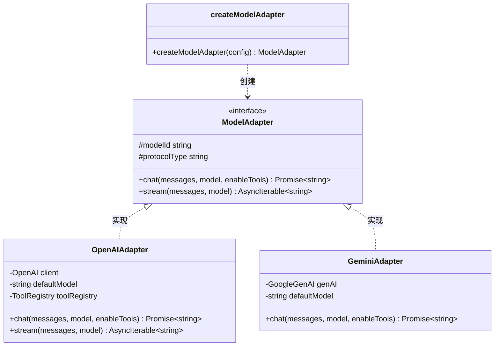

**适配器说明**：

### ✅ OpenAIAdapter
- **支持协议**：OpenAI、硅基流动、Ollama 等兼容协议
- **特性**：
  - ✅ 工具调用（Tool Calling）
  - ✅ 流式输出（Streaming）
  - ✅ 自动重试（最多 2 次）
  - ✅ 超时控制（30 秒）
  - ✅ 迭代限制（最多 5 次工具调用循环）
- **配置**：
  ```typescript
  {
    id: '硅基流动',
    protocolType: 'openai',
    endpoint: 'https://api.siliconflow.cn/v1',
    apiKey: '***',
    modelId: 'Qwen/Qwen3.5-122B-A10B'
  }
  ```

### ✅ GeminiAdapter
- **支持协议**：Google Gemini
- **特性**：
  - ✅ System Instruction
  - ✅ 流式输出（Streaming）
  - ⚠️ 工具调用（待实现）
- **配置**：
  ```typescript
  {
    id: 'gemini',
    protocolType: 'gemini',
    apiKey: '***'
  }
  ```

### ✅ 工厂函数
```typescript
function createModelAdapter(config: ModelConfig): ModelAdapter {
  switch (config.protocolType) {
    case 'openai':
    case 'custom':
      return new OpenAIAdapter(config);
    case 'gemini':
      return new GeminiAdapter(config);
    default:
      return new OpenAIAdapter(config);
  }
}
```

### ❌ 待改进
- ⚠️ GeminiAdapter 不支持工具调用 - 应该实现
- ⚠️ 没有 Anthropic、Ollama 适配器 - 待实现

## 7. MCP 协议工具调用图（实际情况 - 2026-04-12 更新）

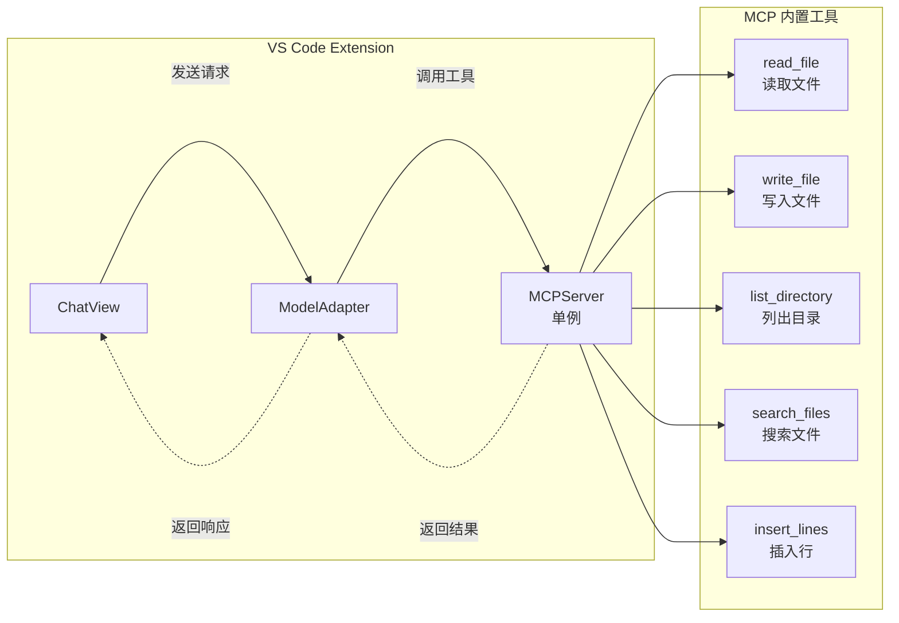

**MCP 工具说明**：

### ✅ MCPServer 架构
- **模式**：单例模式
  ```typescript
  export const mcpServer = new MCPServer();
  ```
- **工具类型**：内置工具处理器（非外部 Skill）
- **工具列表**：
  - `read_file` - 读取文件内容
  - `write_file` - 写入文件
  - `list_directory` - 列出目录内容
  - `search_files` - 搜索文件
  - `insert_lines` - 插入行

### ✅ 工具调用流程
```typescript
// ModelAdapter.chat()
const toolCalls = response.choices[0]?.message?.tool_calls;

for (const toolCall of toolCalls) {
  const toolName = toolCall.function.name;
  const toolArgs = JSON.parse(toolCall.function.arguments);
  
  // 调用 MCPServer 的工具
  const result = await mcpServer.executeTool(toolName, toolArgs);
  
  toolResults.push({
    role: 'tool',
    content: result.content,
    tool_call_id: toolCall.id
  });
}
```

### ✅ 特点
- ✅ **无外部依赖** - 不依赖 SkillManager
- ✅ **直接执行** - MCPServer 内部处理所有工具
- ✅ **错误处理** - 超时、重试机制

### ❌ 待改进
- ⚠️ 不支持自定义工具 - 应该允许用户注册自定义 Skill
- ⚠️ 工具数量固定 - 应该支持动态扩展

## 8. 日志系统架构图（实际情况 - 2026-04-12 更新）

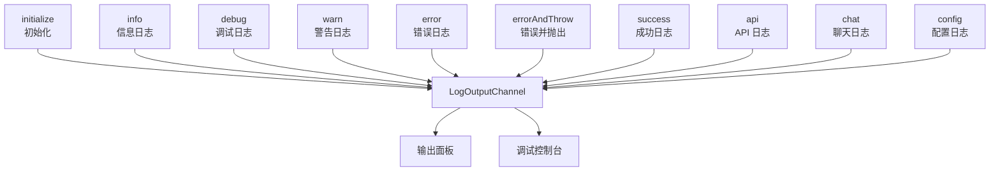

**日志系统说明**：

### ✅ Logger 类
- **输出目标**：
  - VS Code 输出面板（LogOutputChannel）
  - 调试控制台（console）
- **日志级别**：
  - `debug()` - 调试信息
  - `info()` - 一般信息
  - `warn()` - 警告
  - `error()` - 错误
  - `errorAndThrow()` - 记录错误并抛出异常
  - `success()` - 成功信息
- **日志分类**：
  - `api()` - API 调用日志
  - `chat()` - 聊天相关日志
  - `config()` - 配置相关日志

### ✅ 使用示例
```typescript
// 一般日志
Logger.info('Agent 管理器已初始化', { agentCount: 3 });

// 配置日志
Logger.config('保存 Agent 配置文件', { path: configPath });

// 错误并抛出
Logger.errorAndThrow('AgentConfigManager 未初始化');

// API 日志
Logger.api('调用模型 API', { model: 'Qwen/Qwen3.5-122B-A10B' });
```

### ✅ 特点
- ✅ **统一输出** - 所有日志输出到 VS Code 输出面板
- ✅ **分类清晰** - 不同模块使用不同的日志分类
- ✅ **结构化** - 支持传递对象参数

## 9. 项目文件结构图（实际情况 - 2026-04-12 更新）

```mermaid
graph TD
    Root[ai-agent-leobot]
    
    subgraph "源代码 (src/)"
        SrcRoot["src/"]
        
        subgraph ManagersDir["managers/"]
            ModelConfigManager[ModelConfigManager.ts<br/>模型配置管理]
            AgentConfigManager[AgentConfigManager.ts<br/>Agent 配置管理]
            AgentManager[AgentManager.ts<br/>Agent 运行时管理]
            ChatHistoryManager[ChatHistoryManager.ts<br/>聊天历史管理]
        end
        
        subgraph FeaturesDir["features/"]
            ChatView[ChatView.ts<br/>聊天视图]
            ConfigPanel[ConfigPanel.ts<br/>配置面板]
            ConfigPanelView[configPanelView.ts<br/>配置面板前端]
        end
        
        subgraph AdaptersDir["adapters/"]
            ModelAdapter[modelAdapter.ts<br/>模型适配]
        end
        
        subgraph ToolsDir["tools/"]
            MCP[mcp.ts<br/>MCP 服务器]
            ToolRegistry[ToolRegistry.ts<br/>工具注册]
            Skills[skills.ts<br/>技能定义<br/>未使用]
        end
        
        subgraph UtilsDir["utils/"]
            Logger[Logger.ts<br/>日志系统]
            Crypto[crypto.ts<br/>加密工具]
        end
        
        subgraph TestDir["test/"]
            ExtensionTest[extension.test.ts<br/>测试文件]
        end
        
        Extension[extension.ts<br/>入口文件]
        ConfigManager["configManager.ts<br/>配置管理<br/>旧"]
        Types[types.ts<br/>类型定义]
    end
    
    subgraph "媒体资源 (media/)"
        ConfigPanelHTML[configPanel.html<br/>配置面板 UI]
        ChatViewHTML[chatView.html<br/>聊天视图 UI]
        SystemPrompt[system_prompt.md<br/>系统提示词模板]
        ChatViewCSS[chatView.css<br/>聊天视图样式]
        TestMarkdown[testMarkdown.md<br/>测试文件]
    end
    
    subgraph "配置文件"
        PackageJson[package.json]
        TsConfig[tsconfig.json]
        TsConfigFrontend[tsconfig.frontend.json]
        VsCodeIgnore[.vscodeignore]
        ESBuild[esbuild.js<br/>打包配置]
    end
    
    subgraph "文档 (docs/)"
        Readme[README.md]
        Changelog[CHANGELOG.md]
        Analysis[分析.md]
        RealityDoc["现实情况.md<br/>本文档"]
    end
    
    subgraph "输出目录 (out/)"
        OutJS[out/*.js<br/>编译后的 JS]
        OutMap[out/*.map<br/>Source Map]
    end
    
    subgraph "分发目录 (dist/)"
        DistCJS[dist/extension.cjs<br/>打包后的扩展]
    end
    
    Root --> SrcRoot
    SrcRoot --> ManagersDir
    SrcRoot --> FeaturesDir
    SrcRoot --> AdaptersDir
    SrcRoot --> ToolsDir
    SrcRoot --> UtilsDir
    SrcRoot --> TestDir
    SrcRoot --> Extension
    SrcRoot --> ConfigManager
    SrcRoot --> Types
    
    ManagersDir --> ModelConfigManager
    ManagersDir --> AgentConfigManager
    ManagersDir --> AgentManager
    ManagersDir --> ChatHistoryManager
    
    FeaturesDir --> ChatView
    FeaturesDir --> ConfigPanel
    FeaturesDir --> ConfigPanelView
    
    AdaptersDir --> ModelAdapter
    
    ToolsDir --> MCP
    ToolsDir --> ToolRegistry
    ToolsDir --> Skills
    
    UtilsDir --> Logger
    UtilsDir --> Crypto
    
    TestDir --> ExtensionTest
    
    Root --> ConfigPanelHTML
    Root --> ChatViewHTML
    Root --> SystemPrompt
    Root --> ChatViewCSS
    Root --> TestMarkdown
    
    Root --> PackageJson
    Root --> TsConfig
    Root --> TsConfigFrontend
    Root --> VsCodeIgnore
    Root --> ESBuild
    
    Root --> Readme
    Root --> Changelog
    Root --> Analysis
    Root --> RealityDoc
    
    Root --> OutJS
    Root --> OutMap
    
    Root --> DistCJS
```

**关键文件说明**：

### ✅ 核心文件
- `extension.ts` - 插件入口，注册命令
- `chatView.ts` - 聊天视图逻辑
- `configPanel.ts` + `configPanelView.ts` - 配置面板（前后端分离）
- `ModelConfigManager.ts` - 模型配置管理
- `AgentConfigManager.ts` - Agent 配置管理
- `AgentManager.ts` - Agent 运行时管理
- `modelAdapter.ts` - 模型适配器（OpenAI、Gemini）
- `mcp.ts` - MCP 服务器（内置工具）
- `logger.ts` - 统一日志系统

### ✅ 配置文件
- `media/system_prompt.md` - 系统提示词模板（唯一数据源）
- `esbuild.js` - ESBuild 打包配置
- `.vscodeignore` - 打包时忽略的文件

### ✅ 输出目录
- `out/` - TypeScript 编译输出
- `dist/` - ESBuild 打包输出（extension.cjs）
- `media/` - Webview 资源（打包后）

### ❌ 待改进
- ⚠️ `skills.ts` 未使用 - 应该集成或删除
- ⚠️ 文件命名不统一 - 有些用驼峰，有些用下划线

## 10. 命令注册图（计划中 - 2026-04-12）

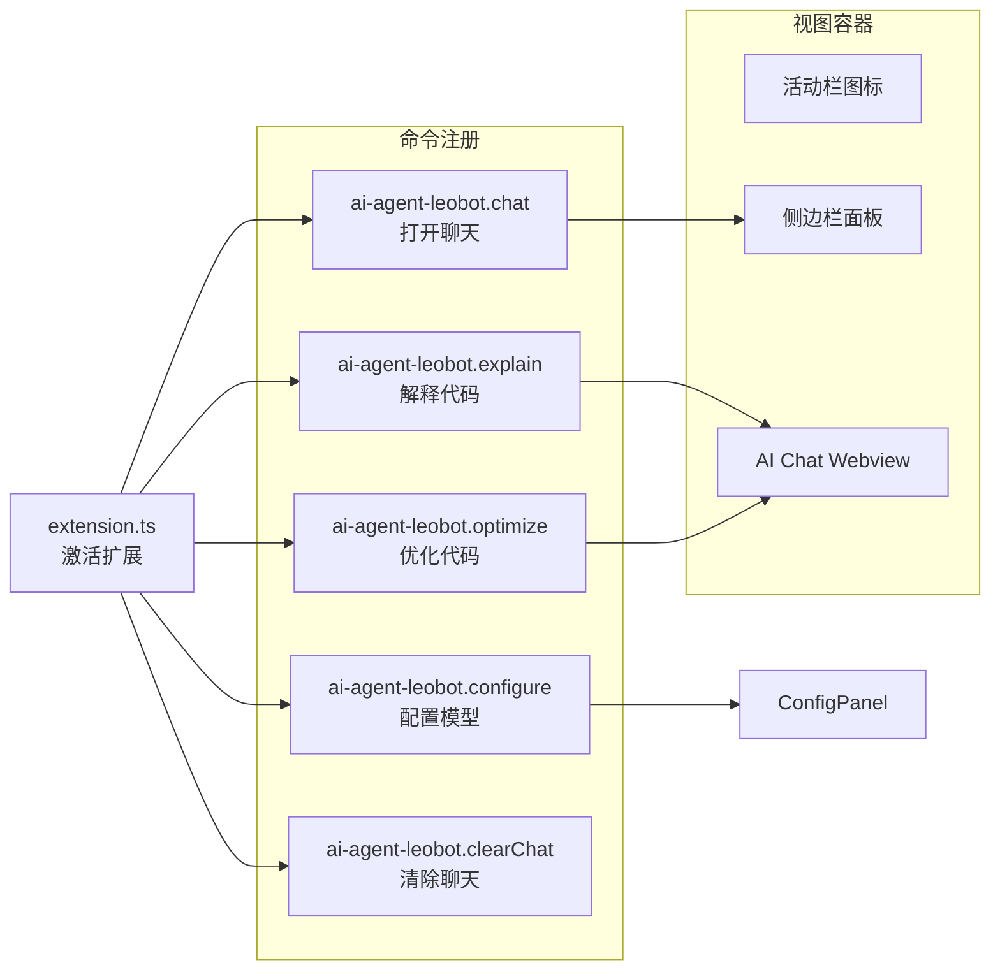

## 11. 配置面板 UI 结构图（实际情况 - 2026-04-12）

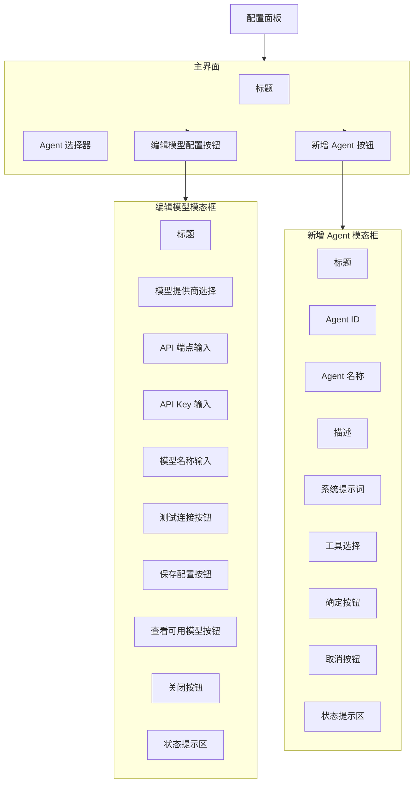

## 12. 消息传递协议图（实际情况 - 2026-04-12）

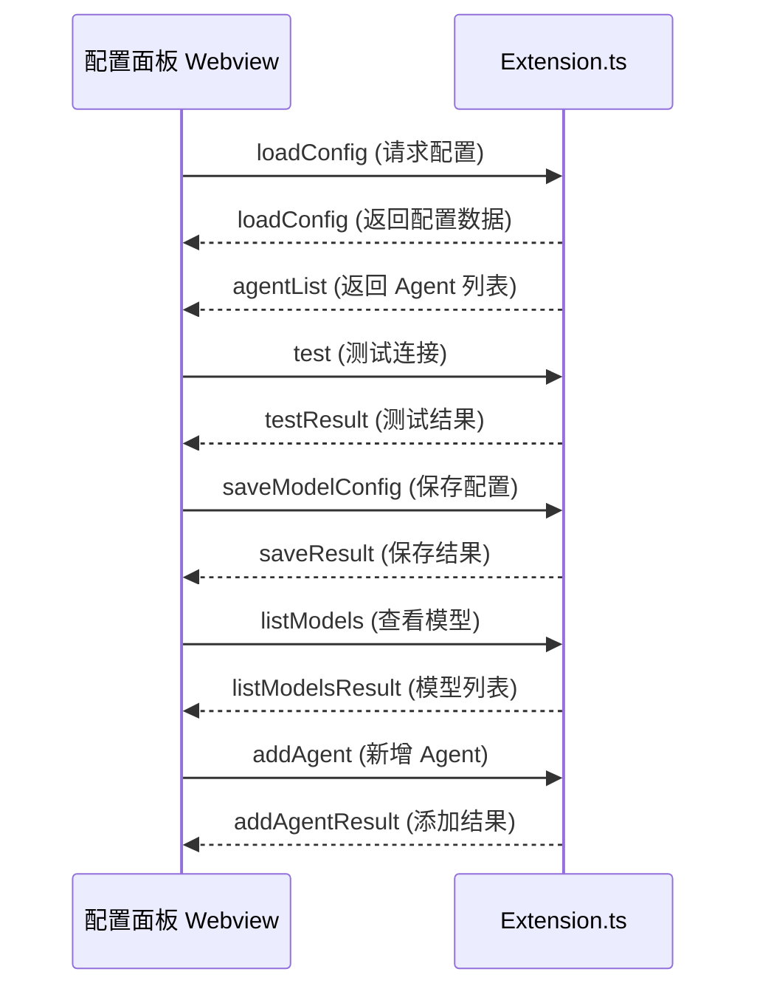

## 13. 技术栈分析（实际情况 - 2026-04-12）

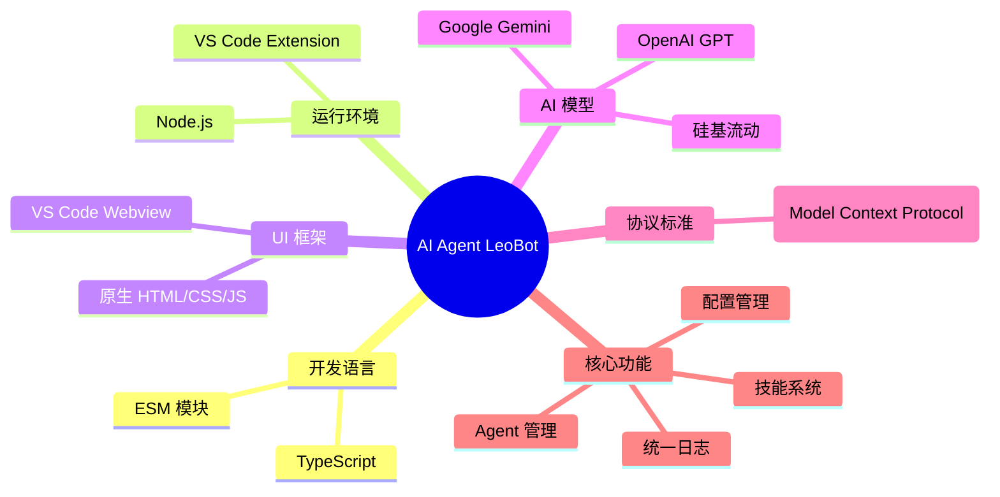

## 14. 项目规模统计（计划中 - 2026-04-12）

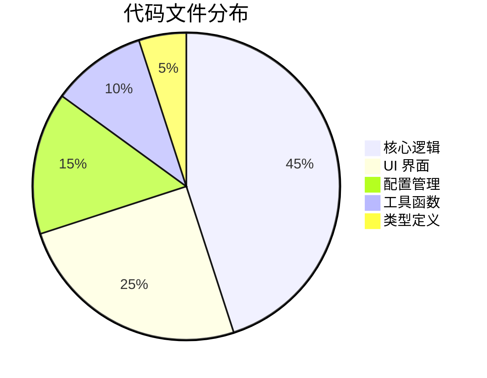

## 15. 系统特性评分（实际情况 - 2026-04-12）

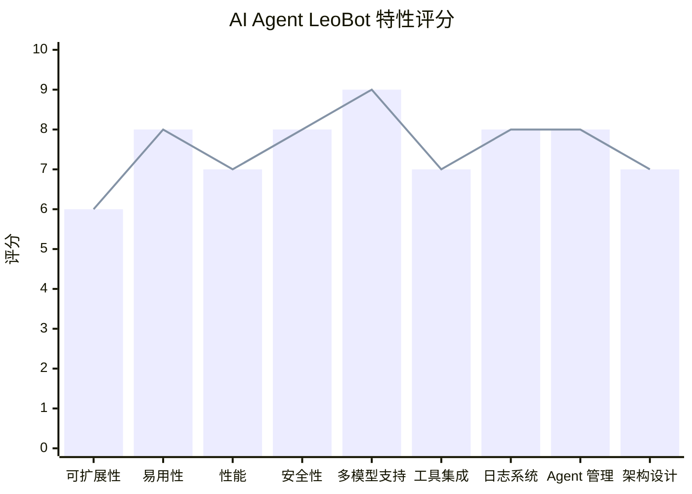

**评分说明**：

| 特性 | 评分 | 说明 |
|------|------|------|
| **可扩展性** | 6 | ⚠️ Skill 系统未实现，工具固定 |
| **易用性** | 8 | ✅ 配置面板友好，Agent 切换方便 |
| **性能** | 7 | ✅ ESBuild 打包优化，⚠️ Agent 全缓存 |
| **安全性** | 8 | ✅ API Key 加密存储，⚠️ 无其他安全措施 |
| **多模型支持** | 9 | ✅ OpenAI、Gemini、硅基流动等 |
| **工具集成** | 7 | ✅ MCP 内置工具，⚠️ 不支持自定义 |
| **日志系统** | 8 | ✅ 统一输出，分类清晰 |
| **Agent 管理** | 8 | ✅ 配置分离，职责清晰 |
| **架构设计** | 7 | ✅ 分层清晰，⚠️ 缺少事件机制 |

---

## 总结

### 架构优势
1. **配置管理清晰** - 模型配置和 Agent 配置分离，配置层和业务层职责明确
2. **单一数据源** - 系统提示词只存储在 `media/system_prompt.md`，避免数据不一致
3. **ESBuild 优化** - 代码混淆压缩，包体积从 8.2 MB 降至 351 KB
4. **MCP 工具集成** - 内置文件操作工具，超时、重试机制完善
5. **模块化设计** - 各模块职责清晰，依赖关系明确
6. **适配器模式** - 支持多种 AI 模型，易于扩展

### 技术亮点
1. **ESM 模块系统** - 现代化的 JavaScript 模块标准
2. **TypeScript 类型安全** - 完整的类型定义
3. **Webview UI** - 原生 HTML/CSS 实现，无额外依赖
4. **配置管理** - 安全的密钥存储和配置持久化
5. **模态框设计** - 用户友好的配置界面

### 待优化方向
1. **添加事件机制** - 观察者模式，配置变化自动通知
2. **按需加载** - 只缓存当前 Agent，减少内存占用
3. **移除冗余代码** - 清理未使用的方法和变量
4. **整合 Skill 系统** - 支持用户自定义工具
5. **完善适配器** - 实现 Gemini 工具调用，添加 Anthropic、Ollama 支持
6. **增加单元测试** - 提高代码质量和可维护性
