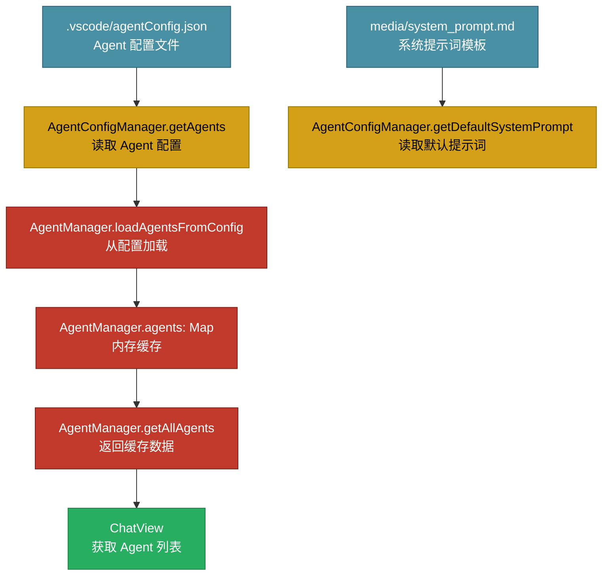

# AI Agent LeoBot 架构问题分析

## 📋 问题分类

- 🔴 **严重问题** - 影响系统稳定性、可维护性
- 🟡 **中等问题** - 影响性能、代码质量
- 🟢 **轻微问题** - 代码规范、待优化项

---

## 📊 问题汇总

| 问题 | 严重程度 | 优先级 | 状态 |
|------|---------|--------|------|
| ~~循环依赖风险~~ | 🔴 严重 | 高 | ✅ 已修复（删除 ModelConfigManager.getAllAgents） |
| 缺少事件驱动机制 | 🔴 严重 | 高 | ⏳ 待修复 |
| AgentManager 缓存所有 Agent | 🟡 中等 | 中 | ⏳ 待修复 |
| ~~registerDefaultAgents() 冗余~~ | 🟡 中等 | 中 | ✅ 已修复（已删除） |
| 缺少 ModelManager 统一管理 | 🟡 中等 | 中 | ⏳ 待实施 |
| ~~职责不清的方法~~ | 🟡 中等 | 中 | ✅ 已修复（删除 getAllAgents） |
| skills.ts 未使用 | 🟡 中等 | 中 | ⏳ 待修复（保留待整合） |
| ~~AgentConfigManager 职责混淆~~ | 🟡 中等 | 中 | ✅ 已解决（维持现状） |
| ~~文件命名不统一~~ | 🟢 轻微 | 低 | ✅ 已解决（统一使用驼峰命名） |
| GeminiAdapter 不支持工具调用 | 🟢 轻微 | 低 | ⏳ 待修复 |
| 缺少 Anthropic、Ollama 适配器 | 🟢 轻微 | 低 | ⏳ 待修复 |

---

## 🎯 修复建议

### ✅ 第一阶段（已完成）

1. **~~移除循环依赖~~** ✅ 已完成
   - ~~删除 `ModelConfigManager.getAllAgents()`~~
   - ~~直接使用 `agentManager`~~

2. **~~清理冗余代码~~** ✅ 已完成
   - ~~删除 `registerDefaultAgents()`~~
   - ~~统一错误处理~~

3. **~~代码规范统一~~** ✅ 已完成
   - ~~统一文件命名（驼峰命名）~~
   - ~~统一代码风格~~

### 第二阶段（中优先级 - 待实施）

4. **添加事件驱动机制**
   - 实现观察者模式
   - 使用 `vscode.EventEmitter`
   - 配置变化自动通知

5. **优化 Agent 加载**
   - 改为按需加载
   - 只缓存当前 Agent

6. **处理 skills.ts**
   - 决定整合到 MCP 工具链或删除

### 第三阶段（低优先级 - 待实施）

7. **完善适配器**
   - 实现 Gemini 工具调用
   - 添加 Anthropic、Ollama 适配器

---

## 📝 总结

### 当前架构优势
- ✅ 配置管理分离
- ✅ 单一数据源
- ✅ 职责基本清晰
- ✅ ESBuild 优化
- ✅ 文件结构重构完成（managers, features, adapters, tools, utils）
- ✅ 导入路径全部修复

### 已解决问题 ✅
- ✅ ~~循环依赖风险~~ - 删除 ModelConfigManager.getAllAgents()
- ✅ ~~registerDefaultAgents() 冗余~~ - 已删除
- ✅ ~~职责不清的方法~~ - 已修复
- ✅ ~~文件命名不统一~~ - 统一使用驼峰命名
- ✅ ~~AgentConfigManager 职责混淆~~ - 维持现状，设计合理

### 主要问题（待修复）
- 🔴 缺少事件驱动机制 - 配置变化无法自动通知
- 🟡 AgentManager 缓存所有 Agent - 内存浪费
- 🟡 skills.ts 未使用 - 待整合或删除

### 改进方向
1. **添加观察者模式**（高优先级）
   - 使用 vscode.EventEmitter
   - 配置变化自动通知相关组件
   
2. **按需加载 Agent**（中优先级）
   - 只缓存当前 Agent
   - 从配置文件按需读取
   
3. **处理 skills.ts**（中优先级）
   - 整合到 MCP 工具链
   - 或者删除
   
4. **完善适配器实现**（低优先级）
   - 实现 Gemini 工具调用
   - 添加 Anthropic、Ollama 适配器

---

## 🔴 严重问题

### 1. 循环依赖风险

**问题描述**：`ModelConfigManager.getAllAgents()` 方法直接调用 `agentManager`

**位置**：`src/modelConfigManager.ts` Line 225

```typescript
// modelConfigManager.ts
import { agentManager } from './agentManager.js';

export class ModelConfigManager {
  getAllAgents(): any[] {
    // ❌ 配置层依赖业务层
    return agentManager.getAllAgents();
  }
}
```

**依赖链**：
```
ModelConfigManager (配置层)
  ↓ 调用
AgentManager (业务层)
  ↓ 依赖
AgentConfigManager (配置层)
  ↓ 可能形成循环
```

**危害**：
- ⚠️ 违反依赖倒置原则
- ⚠️ 配置层不应该依赖业务层
- ⚠️ 可能导致循环引用错误
- ⚠️ 难以单元测试

**解决方案**：
```typescript
// ❌ 删除 ModelConfigManager.getAllAgents() 方法

// ✅ 需要获取 Agent 的地方直接使用 agentManager
import { agentManager } from './agentManager.js';
const agents = agentManager.getAllAgents();
```

**优先级**：🔴 高

---

### 2. 缺少事件驱动机制

**问题描述**：配置变化时无法自动通知相关组件

**影响范围**：
- `AgentConfigManager` 修改配置后，`AgentManager` 不知道
- `ModelConfigManager` 修改配置后，相关组件不知道
- 用户需要重启或手动刷新才能看到变化

**当前流程**：
```
用户修改配置
  ↓
ConfigPanel 保存配置
  ↓
AgentConfigManager.updateAgents()
  ↓
❌ 没有通知机制
  ↓
AgentManager 仍使用旧缓存
  ↓
ChatView 获取的是旧数据
```

**危害**：
- ⚠️ 数据不一致
- ⚠️ 用户体验差（需要重启）
- ⚠️ 可能导致错误行为

**解决方案**：使用观察者模式
```typescript
// agentConfigManager.ts
class AgentConfigManager {
  private _onDidChange = new vscode.EventEmitter<void>();
  readonly onDidChange = this._onDidChange.event;
  
  async updateAgents(agents: AgentConfig[]) {
    await this.writeConfig(config);
    this._onDidChange.fire();  // ✅ 通知变化
  }
}

// agentManager.ts
class AgentManager {
  setConfigManager(configManager: AgentConfigManager) {
    this.configManager = configManager;
    
    // ✅ 订阅变化
    configManager.onDidChange(() => {
      this.reloadAgents();
    });
  }
}
```

**优先级**：🔴 高

---

## 🟡 中等问题

### 3. AgentManager 缓存所有 Agent

**问题描述**：`AgentManager` 启动时加载所有 Agent 到内存，没有数量限制

**位置**：`src/agentManager.ts` Line 42-51

**数据流图**：



**当前代码**：
```typescript
private loadAgentsFromConfig() {
  // ❌ 加载所有 Agent 到内存
  const agents = this.agentConfigManager.getAgents();
  this.agents.clear();
  
  for (const agent of agents) {
    this.agents.set(agent.id, agent);  // 全部缓存
  }
  
  this.currentAgentId = this.agentConfigManager.getDefaultAgent();
}
```

**实际问题**：
- ⚠️ 内存浪费（10 个 Agent 只用 1 个）
- ⚠️ 数据可能过期（配置文件被修改后）
- ⚠️ 启动时间增加
- ⚠️ **内存爆炸风险**（Agent 数量过多时）

**用户建议方案**：限制缓存数量
```typescript
class AgentManager {
  private readonly MAX_CACHED_AGENTS = 10;  // 最多缓存 10 个 Agent
  
  private loadAgentsFromConfig() {
    const agents = this.agentConfigManager.getAgents();
    this.agents.clear();
    
    // ✅ 只缓存前 N 个 Agent
    const limitedAgents = agents.slice(0, this.MAX_CACHED_AGENTS);
    for (const agent of limitedAgents) {
      this.agents.set(agent.id, agent);
    }
    
    Logger.info('从配置文件加载 Agent', { 
      total: agents.length,
      cached: limitedAgents.length,
      limit: this.MAX_CACHED_AGENTS
    });
  }
}
```

**解决方案**：按需加载
```typescript
class AgentManager {
  private currentAgentId: string = 'default';
  
  // ✅ 不缓存所有 Agent，只记录当前 Agent ID
  getCurrentAgent(): AgentConfig {
    if (!this.agentConfigManager) {
      Logger.errorAndThrow('AgentConfigManager 未初始化');
    }
    
    // ✅ 按需从配置文件读取
    return this.agentConfigManager.getAgentById(this.currentAgentId);
  }
  
  switchAgent(agentId: string): boolean {
    // ✅ 只更新 ID，不缓存
    this.currentAgentId = agentId;
    return true;
  }
}
```

**优先级**：🟡 中

---

### 4. 缺少 ModelManager 统一管理

**问题描述**：模型适配器的创建和管理分散在多个地方，缺少统一的 ModelManager

**影响范围**：
- `ChatView` 直接调用 `createModelAdapter()`
- `ConfigPanel` 也可能需要创建模型适配器
- 模型生命周期管理分散

**当前代码**：
```typescript
// ChatView.ts
import { createModelAdapter } from '../adapters/modelAdapter.js';

class ChatViewProvider {
  private _modelAdapter: ModelAdapter | null = null;
  
  async sendMessage() {
    // ❌ 直接调用工厂函数
    this._modelAdapter = createModelAdapter(modelConfig);
    const response = await this._modelAdapter.chat(messages);
  }
}

// ConfigPanel.ts
import { createModelAdapter } from '../adapters/modelAdapter.js';

class ConfigPanel {
  async testModel() {
    // ❌ 也直接调用工厂函数
    const adapter = createModelAdapter(modelConfig);
    await adapter.chat(testMessages);
  }
}
```

**问题分析**：

| 问题 | 说明 | 影响 |
|------|------|------|
| **职责分散** | 多个地方直接调用 `createModelAdapter()` | 代码重复，难以维护 |
| **缺少缓存** | 每次都创建新的适配器实例 | 性能浪费 |
| **缺少生命周期管理** | 适配器何时创建、销毁、复用 | 资源管理混乱 |
| **缺少事件通知** | 模型配置变化无法通知使用者 | 数据不一致 |

**解决方案**：创建 ModelManager

```typescript
// managers/ModelManager.ts
import { ModelAdapter, ModelConfig } from '../types.js';
import { createModelAdapter } from '../adapters/modelAdapter.js';
import { Logger } from '../utils/Logger.js';

export class ModelManager {
  private static instance: ModelManager;
  private adapterCache: Map<string, ModelAdapter> = new Map();
  private currentModelId: string = 'default';
  
  private constructor() {}
  
  static getInstance(): ModelManager {
    if (!ModelManager.instance) {
      ModelManager.instance = new ModelManager();
    }
    return ModelManager.instance;
  }
  
  /**
   * 获取当前模型适配器（带缓存）
   */
  getCurrentAdapter(modelConfig: ModelConfig): ModelAdapter {
    const cacheKey = modelConfig.modelId;
    
    // ✅ 优先从缓存获取
    const cached = this.adapterCache.get(cacheKey);
    if (cached) {
      Logger.debug('使用缓存的模型适配器', { modelId: cacheKey });
      return cached;
    }
    
    // ✅ 缓存未命中，创建新实例
    Logger.debug('创建新的模型适配器', { modelId: cacheKey });
    const adapter = createModelAdapter(modelConfig);
    this.adapterCache.set(cacheKey, adapter);
    
    return adapter;
  }
  
  /**
   * 切换模型
   */
  switchModel(modelId: string): boolean {
    this.currentModelId = modelId;
    Logger.info('切换模型', { modelId });
    return true;
  }
  
  /**
   * 清除缓存
   */
  clearCache(): void {
    this.adapterCache.clear();
    Logger.info('模型适配器缓存已清除');
  }
}

// 使用示例
const modelManager = ModelManager.getInstance();
const adapter = modelManager.getCurrentAdapter(modelConfig);
```

**好处**：

| 好处 | 说明 |
|------|------|
| ✅ **统一管理** | 所有模型适配器通过 ModelManager 创建和管理 |
| ✅ **性能优化** | 缓存常用适配器，避免重复创建 |
| ✅ **生命周期管理** | 控制适配器的创建、复用、销毁 |
| ✅ **事件驱动** | 可以添加模型变化通知机制 |
| ✅ **易于测试** | 可以 Mock ModelManager 进行单元测试 |

**优先级**：🟡 中

---

### 5. registerDefaultAgents() 方法冗余

**问题描述**：`AgentManager.registerDefaultAgents()` 方法功能重复

**位置**：`src/agentManager.ts` Line 82-107

```typescript
private registerDefaultAgents() {
  if (!this.agentConfigManager) {
    Logger.errorAndThrow('AgentConfigManager 未初始化');
    return;
  }

  // ❌ 这个方法做的事情和 loadAgentsFromConfig() 一样
  const agents = this.agentConfigManager.getAgents();
  this.agents.clear();
  
  for (const agent of agents) {
    this.agents.set(agent.id, agent);
  }
  
  this.currentAgentId = this.agentConfigManager.getDefaultAgent();
}
```

**问题**：
- ⚠️ 代码重复
- ⚠️ 职责不清（什么时候调用这个方法？）
- ⚠️ 错误处理不一致

**解决方案**：
```typescript
// ❌ 删除 registerDefaultAgents() 方法

// ✅ 统一使用 loadAgentsFromConfig()
private loadAgentsFromConfig() {
  if (!this.agentConfigManager) {
    Logger.errorAndThrow('AgentConfigManager 未初始化');
  }
  
  const agents = this.agentConfigManager.getAgents();
  // ...
}
```

**优先级**：🟡 中

---

### 6. 职责不清的方法

**问题描述**：`ModelConfigManager` 中包含不属于其职责的方法

**位置**：`src/modelConfigManager.ts` Line 225

```typescript
class ModelConfigManager {
  // ❌ 这个方法不应该在 ModelConfigManager 中
  getAllAgents(): any[] {
    return agentManager.getAllAgents();
  }
}
```

**职责分析**：

| 类 | 应该有的职责 | 不应该有的职责 |
|------|-------------|---------------|
| `ModelConfigManager` | 管理 modelConfig.json<br>CRUD 模型配置<br>管理 API Key | 获取 Agent 列表<br>调用 AgentManager |
| `AgentConfigManager` | 管理 agentConfig.json<br>CRUD Agent 配置<br>读取 system_prompt.md | 管理运行时逻辑 |
| `AgentManager` | 管理 Agent 运行时<br>切换 Agent<br>提供运行时 API | 直接读写配置文件 |

**解决方案**：
```typescript
// ❌ 删除 ModelConfigManager.getAllAgents()

// ✅ 需要获取 Agent 的地方直接使用
import { agentManager } from './agentManager.js';
const agents = agentManager.getAllAgents();
```

**优先级**：🟡 中

---

### 7. ~~AgentConfigManager 职责混淆~~ ✅ 已解决

**问题描述**：AI 建议 `getDefaultSystemPrompt()` 方法违反了单一职责原则

**位置**：`src/managers/AgentConfigManager.ts` Line 28-46

```typescript
class AgentConfigManager {
  public getDefaultSystemPrompt(): string {
    const extensionPath = this._context ? this._context.extensionPath : __dirname;
    const promptPath = path.join(extensionPath, 'media', 'system_prompt.md');
    
    if (!fs.existsSync(promptPath)) {
      throw new Error(`系统提示词文件不存在：${promptPath}...`);
    }
    
    return fs.readFileSync(promptPath, 'utf-8');
  }
}
```

**AI 建议**：
- ❌ 系统提示词读取属于**资源加载**职责
- ❌ 应该移到专门的资源管理器或工具类中

**实际分析**：

**当前设计是合理的** ✅

**理由**：

1. **系统提示词是 Agent 配置的一部分**
   ```typescript
   interface AgentConfig {
     id: string;
     name: string;
     systemPrompt: string;  // ⭐ 这是配置数据
     modelId: string;
   }
   ```

2. **`getDefaultSystemPrompt()` 的使用场景**
   ```typescript
   // 创建新 Agent 时，如果没有指定 systemPrompt，使用默认值
   const agent: AgentConfig = {
     id: 'new-agent',
     name: '新 Agent',
     systemPrompt: agentConfigManager.getDefaultSystemPrompt(), // ⭐ 用于填充配置
     modelId: 'default-model'
   }
   ```

3. **符合单一职责原则**
   - ✅ `AgentConfigManager` 的职责：**管理 Agent 配置**
   - ✅ 系统提示词是 Agent 配置的**核心字段**
   - ✅ 提供默认值是配置管理的合理功能

4. **对比：什么是真正的职责混淆？**
   ```typescript
   // ❌ 这才是职责混淆
   class AgentConfigManager {
     // 在配置管理器里做模型调用
     async callModel(messages: Message[]) {
       const adapter = createModelAdapter();
       return adapter.chat(messages);
     }
   }
   ```

**结论**：
- ✅ 当前设计合理，**不需要修改**
- ✅ `getDefaultSystemPrompt()` 是**配置数据工厂方法**
- ✅ 系统提示词是 Agent 配置的**核心字段**
- ✅ 没有违反单一职责原则
- ✅ 符合实际业务需求

**优先级**：✅ 已解决（维持现状）

---

### 8. skills.ts 未使用

**问题描述**：`skills.ts` 文件存在但未在核心流程中使用

**位置**：`src/skills.ts`

**问题**：
- ⚠️ 代码冗余
- ⚠️ 增加维护成本
- ⚠️ 误导开发者

**解决方案**：
- **方案 A**：整合到 MCP 工具调用链
- **方案 B**：删除该文件

**优先级**：🟡 中

---

## 🟢 轻微问题

### 9. 文件命名不统一

**问题描述**：文件命名风格不一致

**现状**：
```
src/
  ├── modelConfigManager.ts  (驼峰)
  ├── agentConfigManager.ts  (驼峰)
  ├── agentManager.ts        (驼峰)
  ├── modelAdapter.ts        (驼峰)
  ├── chatView.ts            (驼峰)
  └── configPanel.ts         (驼峰)
```

**建议**：
- ✅ 统一使用驼峰命名（推荐）
- ✅ 或者统一使用下划线命名

**优先级**：🟢 低

---

### 10. GeminiAdapter 不支持工具调用

**问题描述**：Gemini 适配器缺少工具调用功能

**位置**：`src/modelAdapter.ts` Line 258-329

**问题**：
- ⚠️ 功能不完整
- ⚠️ 用户体验不一致

**解决方案**：
```typescript
class GeminiAdapter {
  async chat(messages: Message[], model?: string, enableTools: boolean = true) {
    // TODO: 实现工具调用
    // 参考 OpenAIAdapter 的实现
  }
}
```

**优先级**：🟢 低

---

### 11. 缺少 Anthropic、Ollama 适配器

**问题描述**：只实现了 OpenAI 和 Gemini 适配器

**位置**：`src/modelAdapter.ts` Line 339-347

```typescript
function createModelAdapter(config: ModelConfig): ModelAdapter {
  switch (config.protocolType) {
    case 'openai':
    case 'custom':
      return new OpenAIAdapter(config);
    case 'gemini':
      return new GeminiAdapter(config);
    case 'anthropic':
      // ❌ 未实现
      Logger.errorAndThrow('Anthropic 适配器尚未实现');
    case 'ollama':
      // ❌ 未实现
      Logger.errorAndThrow('Ollama 适配器尚未实现');
    default:
      return new OpenAIAdapter(config);
  }
}
```

**优先级**：🟢 低


