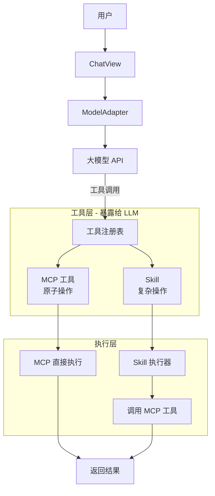

# MCP 与 Skill 智能路由系统设计文档

## 1. 背景与目标

### 1.1 现状

当前系统只有 MCP（Model Context Protocol）工具，所有工具调用都通过 `mcpServer.executeTool()` 执行。虽然存在 `SkillManager`，但未在核心流程中使用。

### 1.2 问题

- **单一工具系统** - 无法区分简单操作和复杂任务
- **缺乏灵活性** - 所有工具都是内置的，无法动态组合
- **扩展性受限** - 自定义能力需要新的架构支持

### 1.3 目标

设计一个智能路由系统，让大模型可以根据任务复杂度选择：

- **简单任务** → 使用 MCP 工具（内置、快速、标准化）
- **复杂任务** → 使用 Skill（可组合、自定义、高级）

## 2. 核心概念

### 2.1 MCP 工具

**定义：** 基础的、原子化的操作单元

**特点：**
- ✅ 内置实现（文件系统、搜索等）
- ✅ 单一职责，不可再分
- ✅ 标准化接口
- ✅ 快速执行
- ✅ **直接被 LLM 调用**

**示例：**
- `read_file` - 读取文件内容
- `write_file` - 写入文件内容
- `list_directory` - 列出目录内容
- `search_files` - 搜索文件

### 2.2 Skill

**定义：** 高级的、可组合的业务逻辑单元

**特点：**
- ✅ **内部组合多个 MCP 工具**
- ✅ 支持自定义业务逻辑
- ✅ 可动态注册
- ✅ 处理复杂场景
- ✅ **对 LLM 暴露为单一工具**

**示例：**
- `refactor-code` - 重构代码
  - 内部：`read_file` → 分析 → `write_file` → 测试
- `add-feature` - 添加功能
  - 内部：创建文件 → 编写代码 → 更新配置
- `debug-issue` - 调试问题
  - 内部：读取 → 分析 → 定位 → 修复

### 2.3 层级关系

**重要：** MCP 和 Skill 不是对等的"可互换"关系，而是**分层**关系：

```
┌─────────────────────────────────┐
│     LLM (大模型)                │
│   可以看到并调用所有工具         │
└─────────────────────────────────┘
           ↓
┌─────────────────────────────────┐
│   工具层（统一暴露给 LLM）        │
│  ┌───────┐  ┌───────┐           │
│  │  MCP  │  │ Skill │           │
│  │ 工具  │  │ (复杂)│           │
│  └───────┘  └───────┘           │
└─────────────────────────────────┘
           ↓
┌─────────────────────────────────┐
│   执行层                         │
│  ┌───────┐  ┌──────────────┐   │
│  │  MCP  │  │    Skill     │   │
│  │直接执行│  │  内部调用 MCP │   │
│  └───────┘  └──────────────┘   │
│                    ↓            │
│              ┌──────────┐       │
│              │ MCP 工具   │       │
│              └──────────┘       │
└─────────────────────────────────┘
```

**关键理解：**
1. **LLM 视角** - MCP 和 Skill 都是"工具"，都可以直接调用
2. **实现视角** - Skill 内部会使用 MCP，MCP 是底层基础
3. **不是互换** - 而是**分层抽象**，Skill 构建在 MCP 之上

## 3. 架构设计

### 3.1 整体架构图



**说明：**
- **工具层** - MCP 和 Skill 都作为"工具"暴露给 LLM
- **执行层** - MCP 直接执行，Skill 内部可能调用 MCP
- **不是路由选择** - 而是**分层调用**关系

## 4. 工具调用策略

### 4.1 策略 1：LLM 自主选择（推荐）

**原理：** 在系统提示词中说明 MCP 和 Skill 的区别，让 LLM 根据任务选择

**系统提示词示例：**
```markdown
你是一个智能编程助手，可以使用以下工具：

## 基础工具（MCP）- 原子操作
用于简单、单一的文件操作：
- read_file: 读取文件内容
- write_file: 写入文件内容  
- list_directory: 列出目录内容
- search_files: 搜索文件

## 高级技能（Skill）- 复杂操作
用于多步骤的复杂任务：
- refactor-code: 重构代码（自动读取→分析→修改→测试）
- add-feature: 添加功能（创建文件→编写代码→更新配置）
- debug-issue: 调试问题（定位→分析→修复）

## 使用建议
1. 简单的文件操作直接使用 MCP 工具
2. 需要多步骤的复杂任务使用 Skill
3. Skill 会自动处理内部细节，你只需要调用它
```

**LLM 调用示例：**

**场景 1：简单任务**
```json
// 用户："帮我读取 package.json"
{
  "name": "read_file",
  "arguments": { "path": "package.json" }
}
```

**场景 2：复杂任务**
```json
// 用户："帮我重构这个文件"
{
  "name": "refactor-code",
  "arguments": { "filePath": "src/index.ts" }
}
// Skill 内部会自动调用 read_file, write_file 等 MCP 工具
```

**优点：**
- ✅ LLM 完全控制，灵活性高
- ✅ 实现简单，无需额外逻辑
- ✅ 符合 LLM 的推理能力

**缺点：**
- ❌ 依赖 LLM 的理解能力
- ❌ 可能选择不当（但概率低）

### 4.2 策略 2：工具命名空间

**原理：** 使用命名空间区分 MCP 和 Skill

**工具命名：**
```typescript
// MCP 工具
const mcpTools = [
  { name: 'mcp.read_file', ... },
  { name: 'mcp.write_file', ... }
];

// Skill
const skills = [
  { name: 'skill.refactor-code', ... },
  { name: 'skill.add-feature', ... }
];
```

**优点：**
- ✅ 清晰区分
- ✅ 易于调试

**缺点：**
- ❌ 增加 LLM 学习成本
- ❌ 命名冗长

### 4.3 策略 3：自动降级（不推荐）

**原理：** 如果 Skill 不存在，自动尝试 MCP

```typescript
async executeTool(name: string, args: any) {
  try {
    // 先尝试 Skill
    if (this.skills.has(name)) {
      return this.skills.get(name).execute(args);
    }
    
    // Skill 不存在，尝试 MCP
    if (this.mcpTools.has(name)) {
      return this.mcpTools.get(name).handler(args);
    }
    
    throw new Error(`工具不存在：${name}`);
  } catch (error) {
    // 降级处理
    Logger.warn('工具执行失败，尝试降级', { name, error });
    // ...
  }
}
```

**优点：**
- ✅ 容错性强

**缺点：**
- ❌ 逻辑复杂
- ❌ 可能掩盖问题

## 5. 系统提示词设计

为了让 LLM 正确选择工具，需要在系统提示词中明确说明：

```markdown
你是一个智能编程助手，可以使用以下工具：

## 基础工具（MCP）- 原子操作
用于简单、单一的文件操作：
- read_file: 读取文件内容
- write_file: 写入文件内容
- list_directory: 列出目录内容
- search_files: 搜索文件

## 高级技能（Skill）- 复杂操作
用于多步骤的复杂任务：
- refactor-code: 重构代码（自动读取→分析→修改→测试）
- add-feature: 添加功能（创建文件→编写代码→更新配置）
- debug-issue: 调试问题（定位→分析→修复）

## 使用建议
1. 简单的文件操作直接使用 MCP 工具
2. 需要多步骤的复杂任务使用 Skill
3. Skill 会自动处理内部细节，你只需要调用它
```

## 6. 实现步骤

### 6.1 第一步：统一工具注册表

**文件：** `src/toolRegistry.ts`（新建）

**职责：**
- 注册所有 MCP 工具和 Skill
- 统一暴露给 LLM
- 执行工具调用

```typescript
import { MCPTool } from './mcp.js';
import { Skill } from './skills.js';
import { Logger } from './logger.js';

export interface Tool {
  name: string;
  description: string;
  inputSchema: any;
  execute(args: any): Promise<any>;
  source: 'mcp' | 'skill';
}

export class ToolRegistry {
  private static instance: ToolRegistry;
  private tools: Map<string, Tool> = new Map();
  
  private constructor() {}
  
  static getInstance(): ToolRegistry {
    if (!ToolRegistry.instance) {
      ToolRegistry.instance = new ToolRegistry();
    }
    return ToolRegistry.instance;
  }
  
  // 注册 MCP 工具
  registerMCPTools(mcpTools: MCPTool[]) {
    for (const tool of mcpTools) {
      const wrappedTool: Tool = {
        name: tool.name,
        description: tool.description,
        inputSchema: tool.inputSchema,
        execute: (args) => tool.handler(args),
        source: 'mcp'
      };
      this.tools.set(tool.name, wrappedTool);
      Logger.debug('注册 MCP 工具', { name: tool.name });
    }
  }
  
  // 注册 Skill
  registerSkills(skills: Skill[]) {
    for (const skill of skills) {
      const wrappedTool: Tool = {
        name: skill.name,
        description: skill.description,
        inputSchema: this.getSkillSchema(skill.name),
        execute: (args) => skill.execute(args),
        source: 'skill'
      };
      this.tools.set(skill.name, wrappedTool);
      Logger.debug('注册 Skill', { name: skill.name, source: 'skill' });
    }
  }
  
  // 获取所有工具（给 LLM 用）
  listTools(): Tool[] {
    return Array.from(this.tools.values());
  }
  
  // 执行工具
  async executeTool(name: string, args: any): Promise<any> {
    const tool = this.tools.get(name);
    if (!tool) {
      throw new Error(`工具不存在：${name}`);
    }
    
    Logger.info('执行工具', { 
      name, 
      source: tool.source,
      args: JSON.stringify(args).substring(0, 100) 
    });
    
    return tool.execute(args);
  }
  
  // 获取 Skill 的输入 schema（需要手动定义或从 Skill 获取）
  private getSkillSchema(skillName: string): any {
    const schemas: Record<string, any> = {
      'refactor-code': {
        type: 'object',
        properties: {
          filePath: { type: 'string', description: '要重构的文件路径' }
        },
        required: ['filePath']
      },
      'add-feature': {
        type: 'object',
        properties: {
          featureName: { type: 'string', description: '功能名称' },
          description: { type: 'string', description: '功能描述' }
        },
        required: ['featureName', 'description']
      }
    };
    return schemas[skillName] || { type: 'object', properties: {} };
  }
}
```

### 6.2 第二步：修改 MCP Server

**文件：** `src/mcp.ts`（修改）

```typescript
// 移除 listTools 和 executeTool，改为返回原始工具列表
export class MCPServer {
  // ... 现有代码 ...
  
  // 获取所有 MCP 工具（供 ToolRegistry 使用）
  getTools(): MCPTool[] {
    return Array.from(this.tools.values());
  }
}

// 导出单例
export const mcpServer = new MCPServer();
```

### 6.3 第三步：修改 SkillManager

**文件：** `src/skills.ts`（修改）

```typescript
// 添加 getSkills 方法
export class SkillManager {
  // ... 现有代码 ...
  
  // 获取所有 Skill（供 ToolRegistry 使用）
  getSkills(): Skill[] {
    return Array.from(this.skills.values());
  }
}
```

### 6.4 第四步：集成到 ModelAdapter

**文件：** `src/modelAdapter.ts`（修改）

```typescript
import { ToolRegistry } from './toolRouter.js';

export class OpenAIAdapter {
  private toolRegistry: ToolRegistry;
  
  constructor(config: ModelConfig) {
    // ... 现有代码 ...
    
    // 获取工具注册表
    this.toolRegistry = ToolRegistry.getInstance();
    
    // 注册 MCP 工具
    const mcpServer = await import('./mcp.js');
    this.toolRegistry.registerMCPTools(mcpServer.mcpServer.getTools());
    
    // 注册 Skill
    const skillManager = await import('./skills.js');
    this.toolRegistry.registerSkills(skillManager.SkillManager.getInstance().getSkills());
  }
  
  async chat(messages: Message[], enableTools: boolean = true) {
    // ... 现有代码 ...
    
    // 获取所有工具
    const tools = this.toolRegistry.listTools();
    
    // 转换为 OpenAI 格式
    const openaiTools = tools.map(tool => ({
      type: 'function' as const,
      function: {
        name: tool.name,  // 直接使用工具名，不加前缀
        description: tool.description,
        parameters: tool.inputSchema
      }
    }));
    
    // ... 发送请求 ...
    
    // 执行工具
    const toolName = toolCall.function.name;
    const result = await this.toolRegistry.executeTool(toolName, args);
  }
}
```

### 6.5 第五步：更新系统提示词

**文件：** `src/agentManager.ts`（修改）

```typescript
private getSystemPrompt(): string {
  return `
你是一个智能编程助手，可以使用以下工具：

## 基础工具（MCP）- 原子操作
用于简单、单一的文件操作：
- read_file: 读取文件内容
- write_file: 写入文件内容
- list_directory: 列出目录内容
- search_files: 搜索文件

## 高级技能（Skill）- 复杂操作
用于多步骤的复杂任务：
- refactor-code: 重构代码（自动读取→分析→修改→测试）
- add-feature: 添加功能（创建文件→编写代码→更新配置）
- debug-issue: 调试问题（定位→分析→修复）

## 使用建议
1. 简单的文件操作直接使用 MCP 工具
2. 需要多步骤的复杂任务使用 Skill
3. Skill 会自动处理内部细节，你只需要调用它
`;
}
```

## 7. 使用示例

### 7.1 示例 1：简单任务（使用 MCP）

**用户：** 帮我读取 package.json 的内容

**流程：**

```
用户 → ChatView → ModelAdapter → LLM
LLM 生成工具调用：
{
  "name": "mcp.read_file",
  "arguments": { "path": "package.json" }
}
ToolRouter → mcpServer.executeTool() → 返回文件内容
```

### 7.2 示例 2：复杂任务（使用 Skill）

**用户：** 帮我重构这个文件，优化代码结构

**流程：**

```
用户 → ChatView → ModelAdapter → LLM
LLM 生成工具调用：
{
  "name": "skill.refactor-code",
  "arguments": { "filePath": "src/index.ts" }
}
ToolRouter → skillManager.execute()
skill.refactor-code 内部:
  1. mcp.read_file() 读取文件
  2. 分析代码结构
  3. mcp.write_file() 写入优化后的代码
  4. 返回结果
```

## 8. 预期效果

### 8.1 性能提升

- **简单任务** - 直接使用 MCP，减少中间层，响应更快
- **复杂任务** - 使用 Skill，一次性完成多步骤操作

### 8.2 扩展性增强

- **自定义 Skill** - 用户可以添加自己的 Skill
- **Skill 市场** - 未来可以分享和复用 Skill

### 8.3 用户体验优化

- **智能选择** - 大模型自动选择最合适的工具
- **透明化** - 用户无需关心底层实现

## 9. 风险与挑战

### 9.1 技术风险

- **兼容性问题** - 需要确保 MCP 和 Skill 接口完全兼容
- **性能开销** - 路由层可能增加少量延迟

### 9.2 设计风险

- **路由判断错误** - 自动路由可能误判任务类型
- **工具命名冲突** - MCP 和 Skill 名称可能重复

### 9.3 缓解措施

- **充分测试** - 覆盖各种场景
- **日志记录** - 记录路由决策过程
- **回退机制** - 路由失败时降级处理

## 10. 后续优化方向

### 10.1 短期（v1.0）

- ✅ 实现基础路由功能
- ✅ 支持 MCP 和 Skill 共存
- ✅ 添加完整日志

### 10.2 中期（v2.0）

- 📋 支持 Skill 动态加载
- 📋 实现 Skill 组合编排
- 📋 添加 Skill 配置界面

### 10.3 长期（v3.0）

- 🔮 Skill 市场/插件系统
- 🔮 可视化 Skill 编排器
- 🔮 AI 自动推荐 Skill

## 11. 总结

本设计通过引入智能路由系统，实现了：

1. **分层工具系统** - MCP 处理简单任务，Skill 处理复杂任务
2. **统一接口** - MCP 和 Skill 使用相同的调用方式
3. **灵活路由** - 支持多种路由策略
4. **易于扩展** - 可以动态添加新的 Skill

这将大大提升系统的灵活性和扩展性，为未来的自定义功能打下基础。
