# AI Agent LeoBot 项目分析

## 项目概述

AI Agent LeoBot 是一个运行在 VS Code 中的本地 AI Agent 运行时扩展，支持多模型编排和自定义 Skills。

## 1. 系统架构图

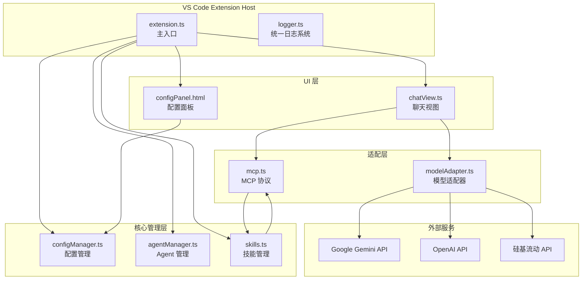

## 2. 模块依赖关系图

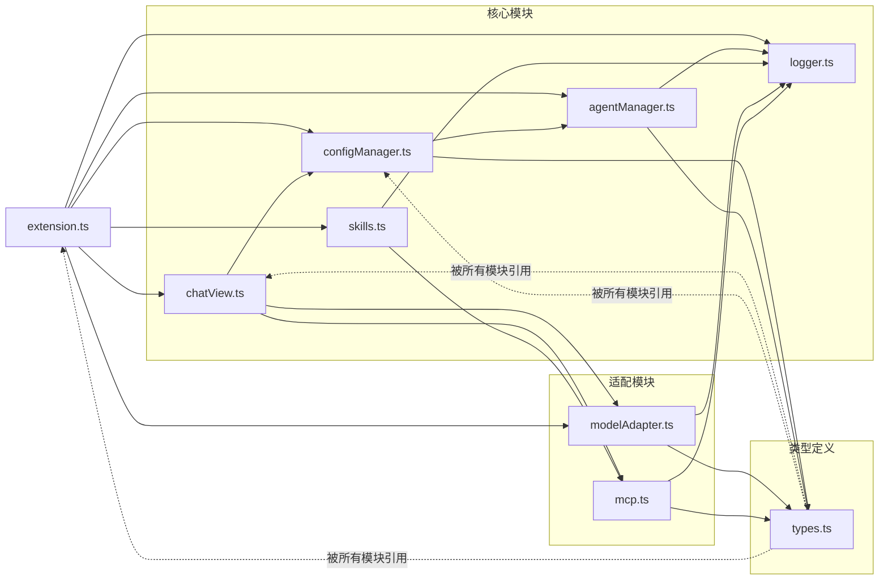

## 3. 数据流图

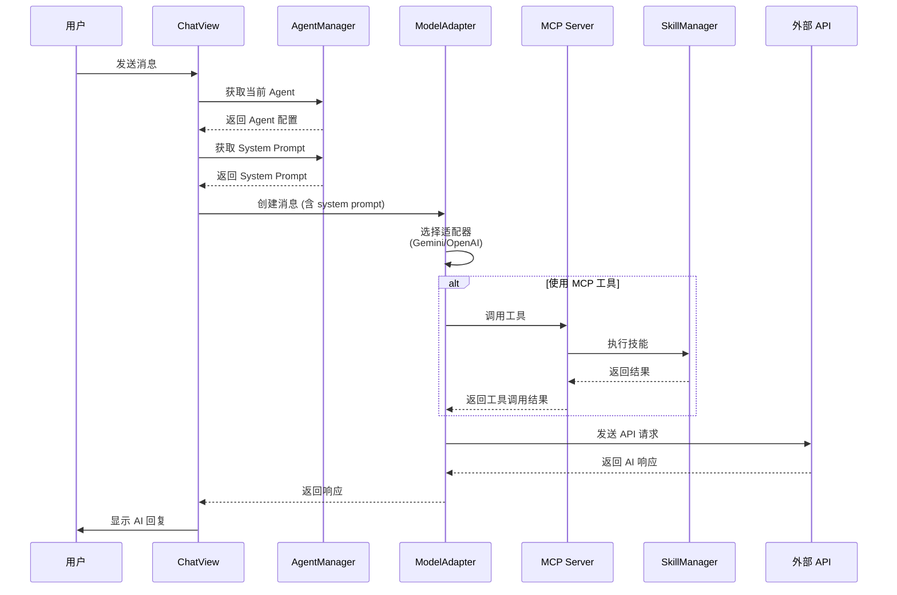

## 4. 配置管理流程图

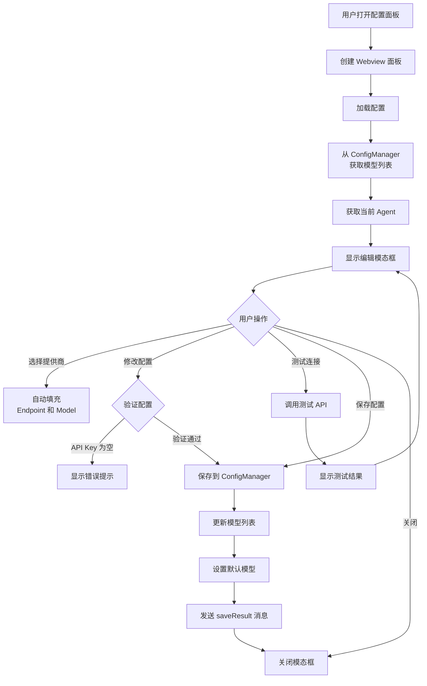

## 5. Agent 管理系统图

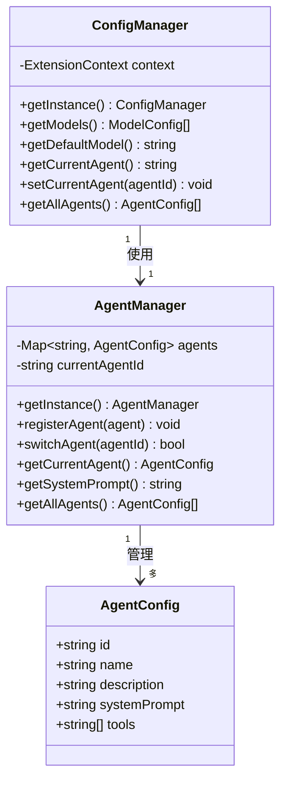

## 6. 模型适配器模式图

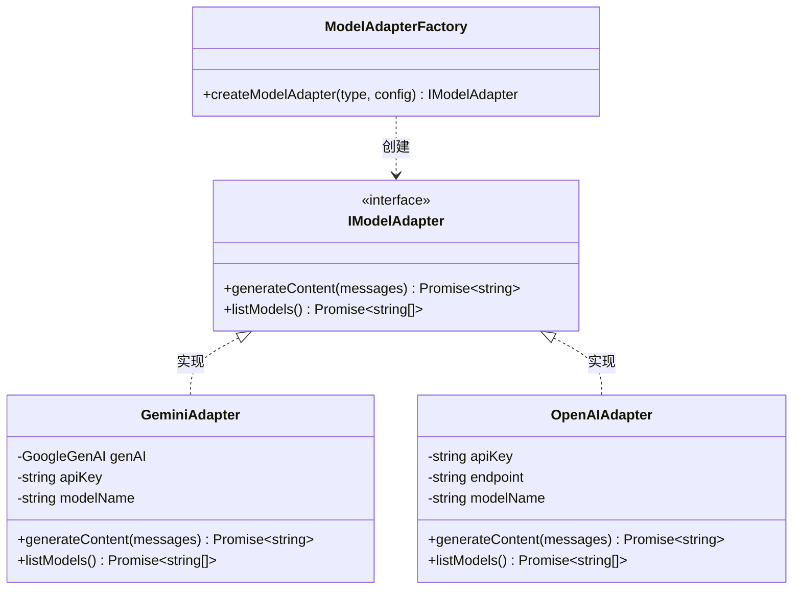

## 7. MCP 协议工具调用图

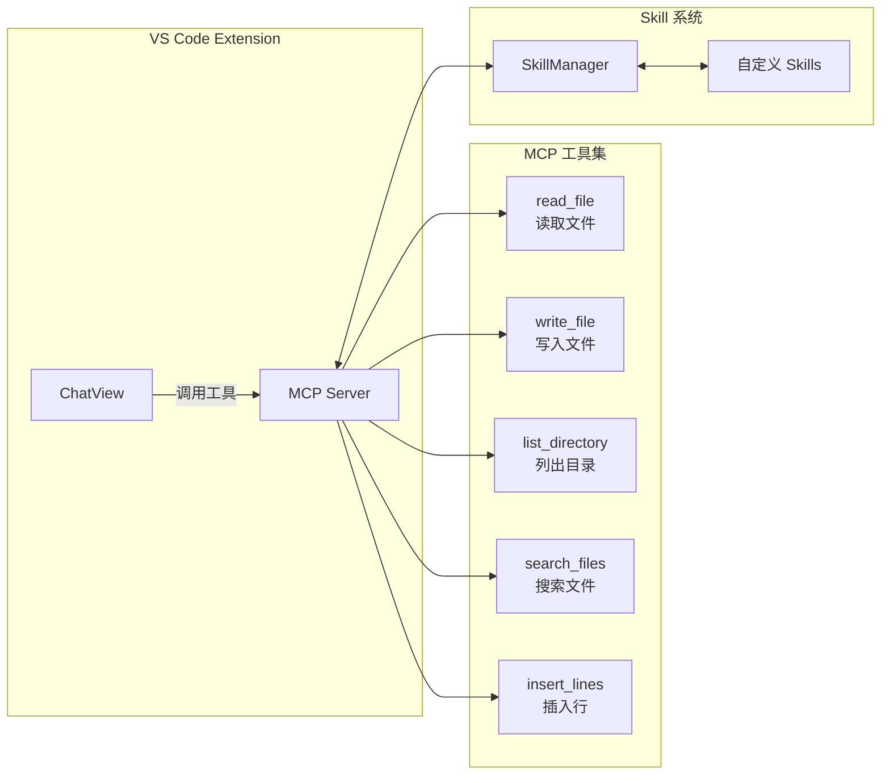

## 8. 日志系统架构图

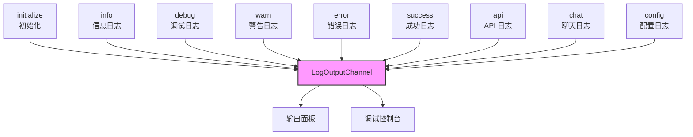

## 9. 项目文件结构图

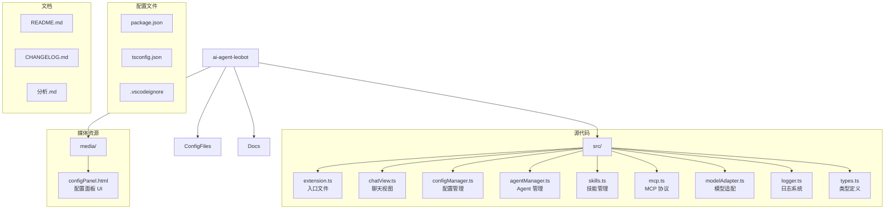

## 10. 命令注册图

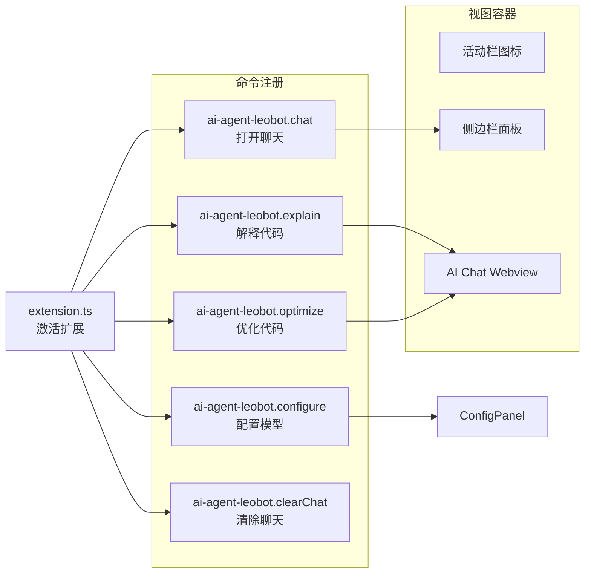

## 11. 配置面板 UI 结构图

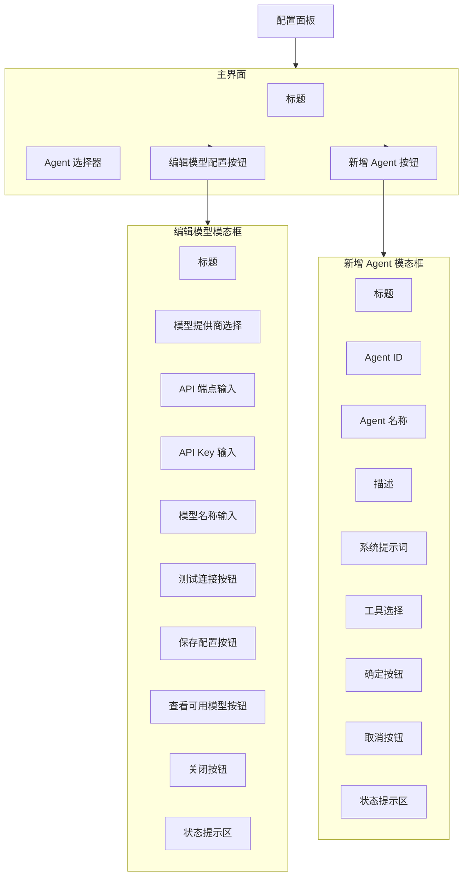

## 12. 消息传递协议图

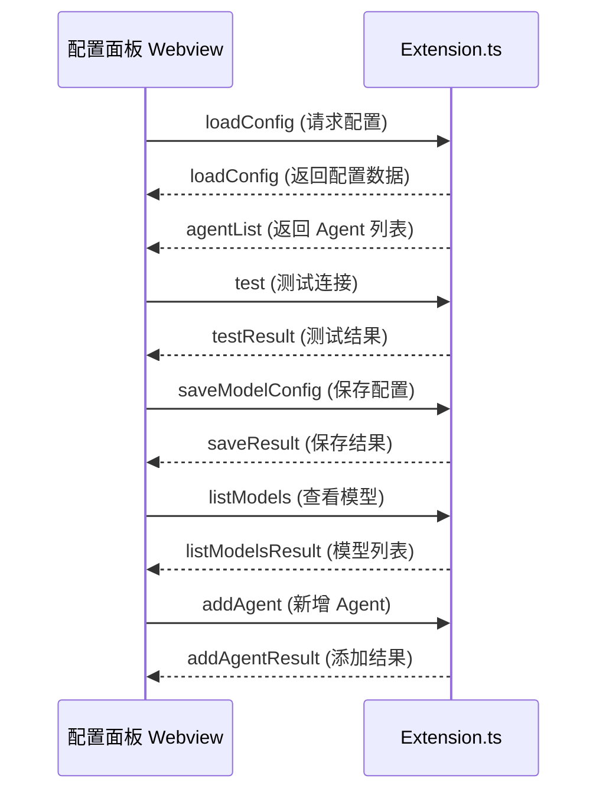

## 13. 技术栈分析

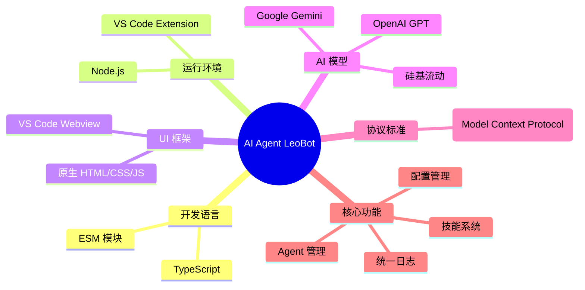

## 14. 项目规模统计

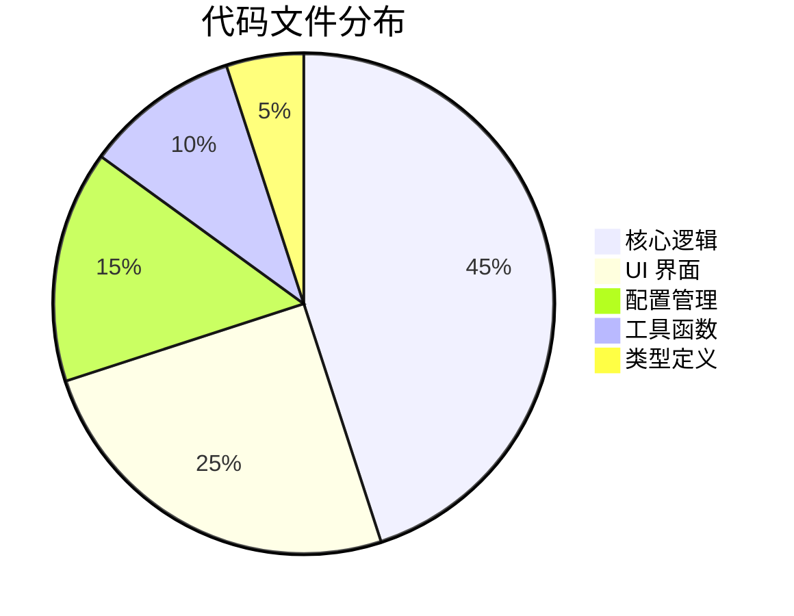

## 15. 系统特性评分

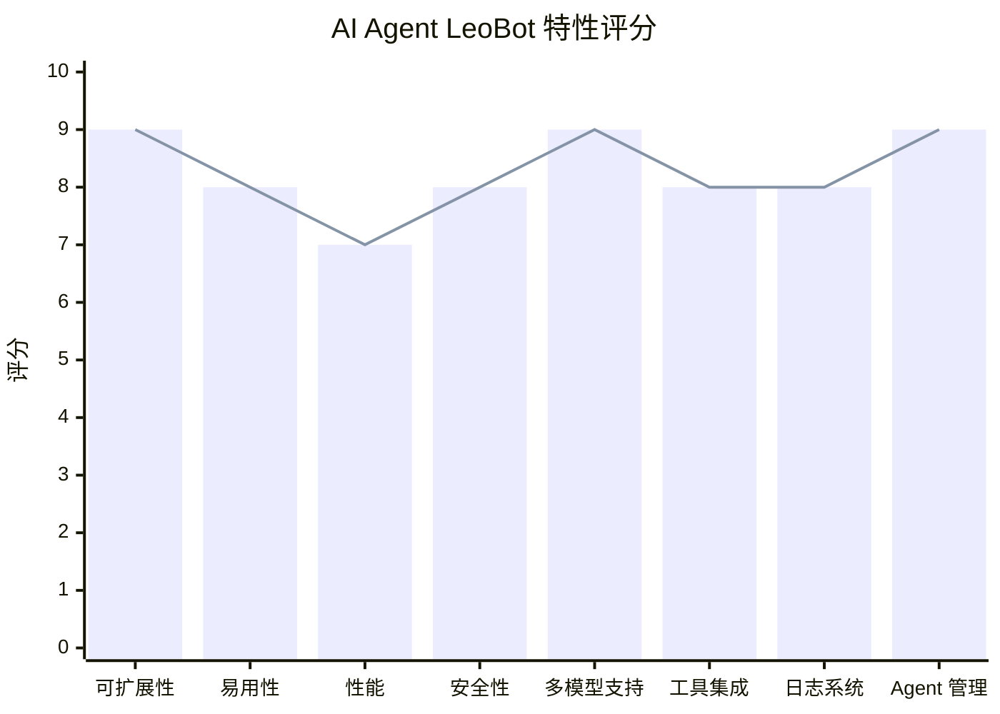

## 总结

### 架构优势
1. **模块化设计** - 各模块职责清晰，依赖关系明确
2. **适配器模式** - 支持多种 AI 模型，易于扩展
3. **Agent 系统** - 支持自定义 Agent 和系统提示词
4. **MCP 协议** - 标准化的工具调用接口
5. **统一日志** - 完善的日志输出系统

### 技术亮点
1. **ESM 模块系统** - 现代化的 JavaScript 模块标准
2. **TypeScript 类型安全** - 完整的类型定义
3. **Webview UI** - 原生 HTML/CSS 实现，无额外依赖
4. **配置管理** - 安全的密钥存储和配置持久化
5. **模态框设计** - 用户友好的配置界面

### 待优化方向
1. 增加单元测试
2. 添加更多预设 Agent
3. 支持更多 AI 模型提供商
4. 增强错误处理和重试机制
5. 添加配置导入导出功能
