# AI Agent LeoBot 项目实际情况分析

## 项目概述

AI Agent LeoBot 是一个运行在 VS Code 中的本地 AI Agent 运行时扩展，支持多模型编排和 MCP 工具调用。

## 1. 系统架构图（实际情况）

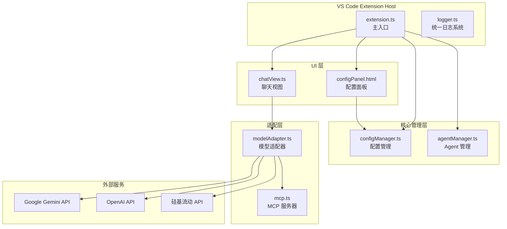

**注意：**

- ❌ **没有 SkillManager 与 MCP 的交互** - MCP Server 是独立的
- ✅ **MCPServer 直接内置工具处理器** - 不依赖 SkillManager
- ✅ **ModelAdapter 直接调用 MCPServer** - 没有中间层

## 2. 模块依赖关系图（实际情况）

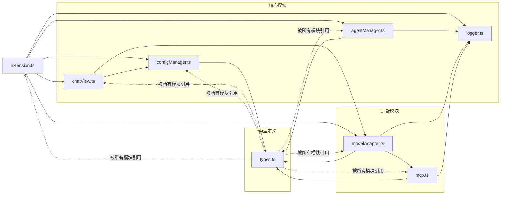

**注意：**

- ❌ **ChatView 不依赖 MCP** - 只通过 ModelAdapter 间接使用
- ❌ **没有 SkillManager 模块的依赖** - skills.ts 存在但未在核心流程中使用
- ✅ **ModelAdapter 直接依赖 MCPServer** - 单例模式

## 3. 数据流图（实际情况）

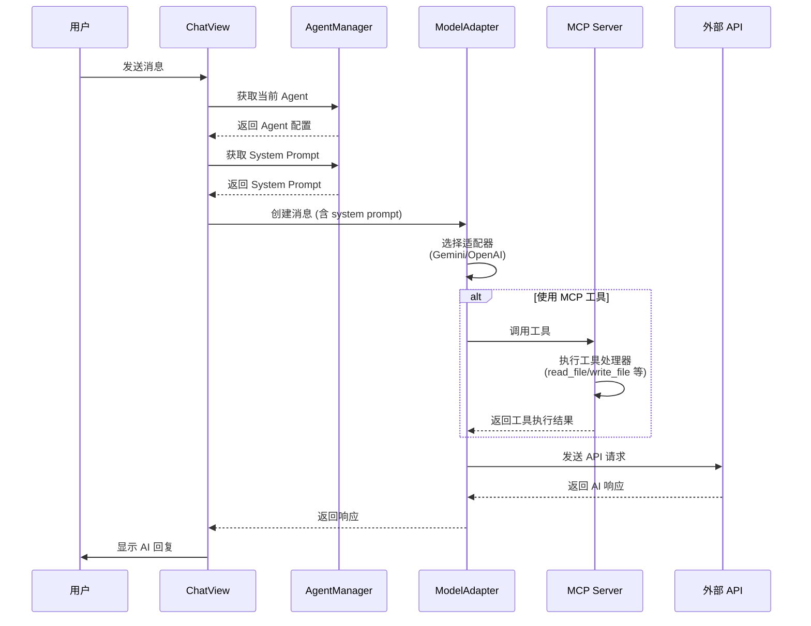

**注意：**

- ❌ **没有 SkillManager 参与** - MCP Server 自己执行工具
- ✅ **MCPServer 直接返回结果给 ModelAdapter** - 没有中间层

## 4. 配置管理流程图（实际情况）

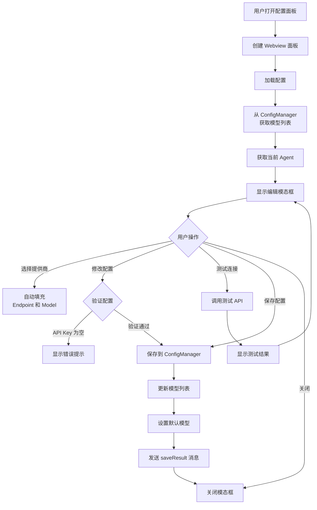

## 5. Agent 管理系统图（实际情况）

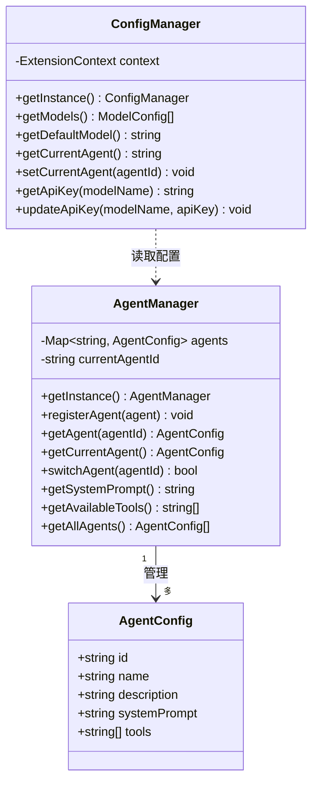

**注意：**

- ✅ **AgentManager 独立管理 Agent** - 不依赖 ConfigManager 存储
- ✅ **ConfigManager 只存储当前 Agent ID** - 不存储完整 Agent 配置

## 6. 模型适配器模式图（实际情况）

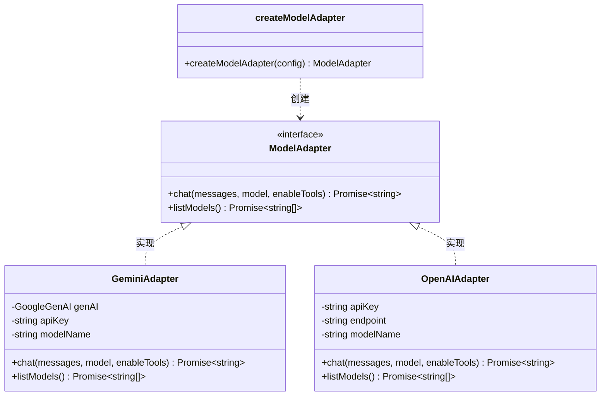

**注意：**

- ✅ **使用函数而非类工厂** - `createModelAdapter` 是函数
- ✅ **接口名为 ModelAdapter** - 不是 IModelAdapter

## 7. MCP 协议工具调用图（实际情况）

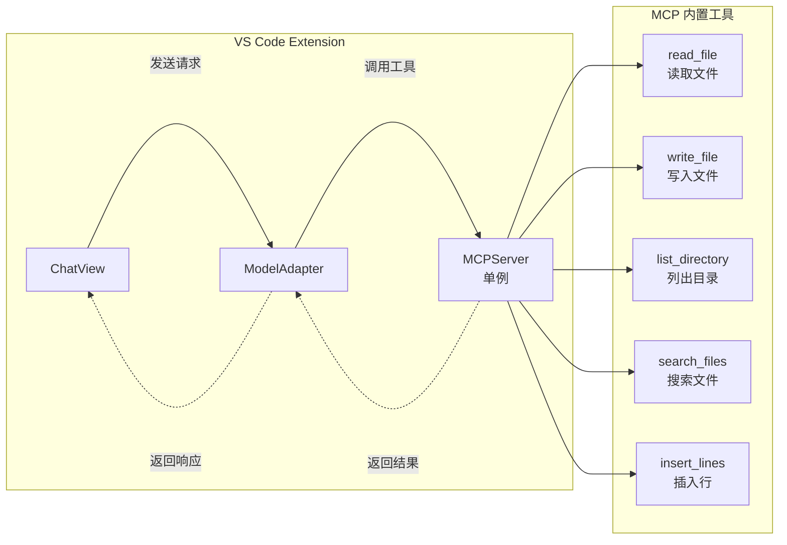

**注意：**

- ❌ **没有 SkillManager** - MCPServer 自己处理所有工具
- ✅ **MCPServer 是单例** - `export const mcpServer = new MCPServer()`
- ✅ **工具是 MCPServer 内部方法** - 不是外部 Skill

## 8. 日志系统架构图（实际情况）

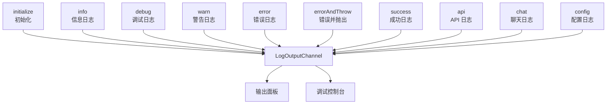

**注意：**

- ✅ **有 errorAndThrow 方法** - 记录错误并抛出异常

## 9. 项目文件结构图（实际情况）

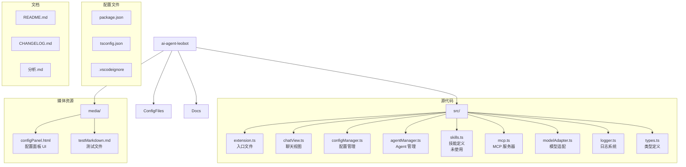

**注意：**

- ⚠️ **skills.ts 存在但未在核心流程中使用** - 定义了 Skill 但未集成
- ✅ **testMarkdown.md 用于 Webview 测试**

## 10. 命令注册图（实际情况）

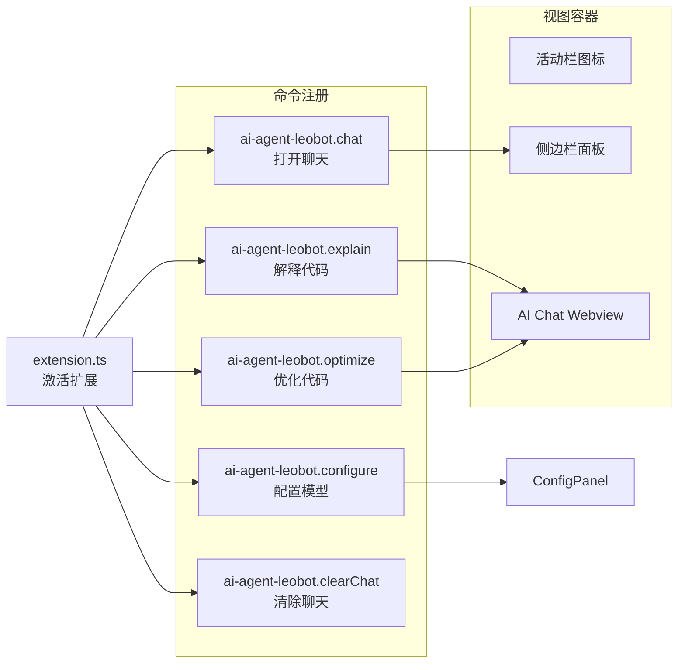

## 11. 配置面板 UI 结构图（实际情况）

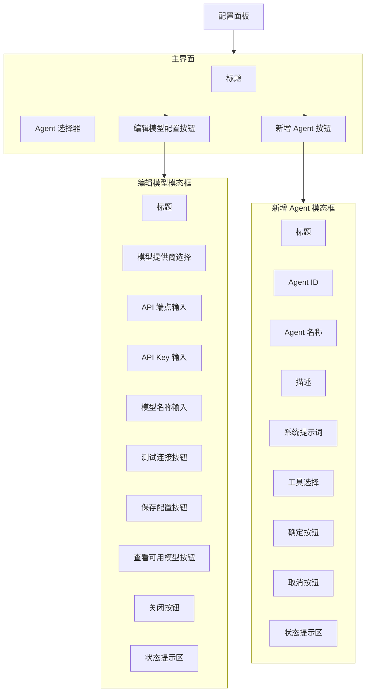

## 12. 消息传递协议图（实际情况）

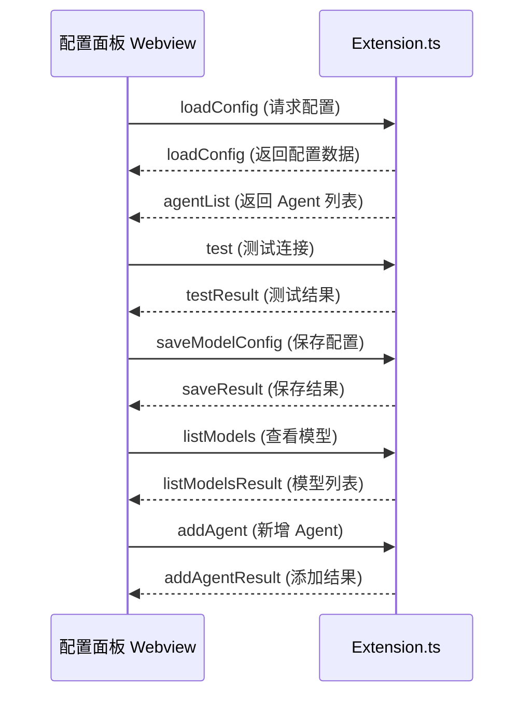

## 13. 技术栈分析（实际情况）

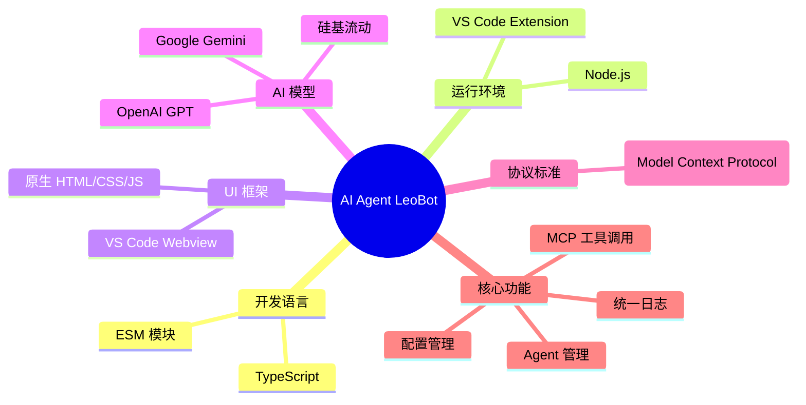

**注意：**

- ❌ **没有自定义 Skill 系统** - skills.ts 未使用
- ✅ **MCP 工具是内置的** - 不是可插拔的

## 14. 项目规模统计（实际情况）

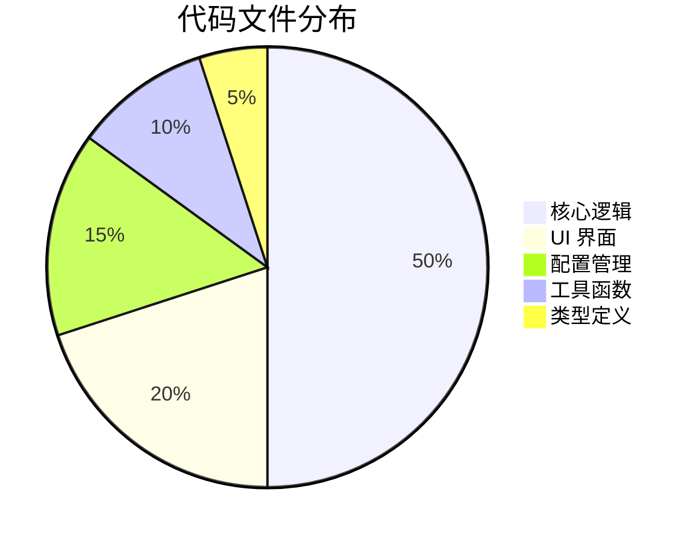

## 15. 系统特性雷达图（实际情况）

## 15. 系统特性评分（实际情况）

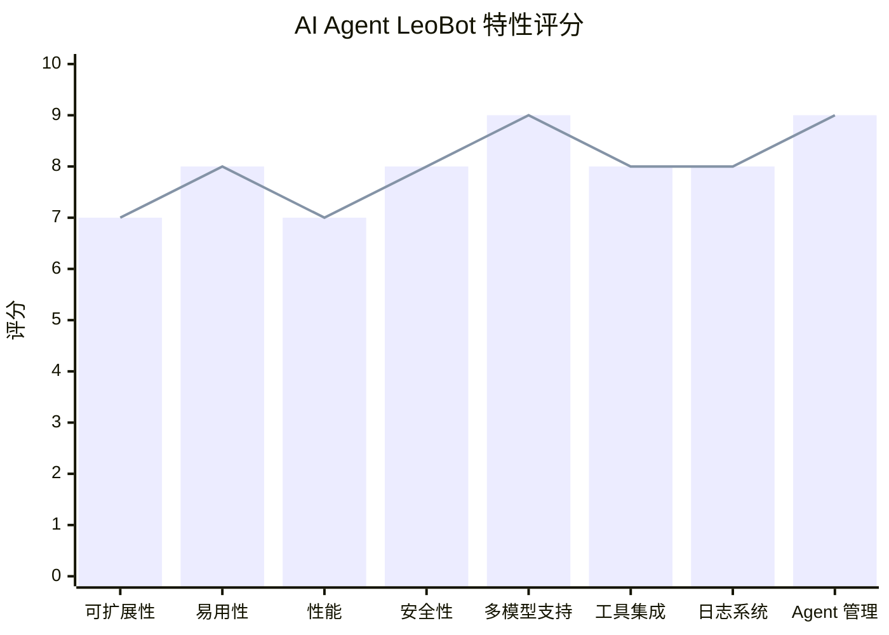

**注意：**

- 可扩展性评分较低 (7) - 因为 Skill 系统未实现，自定义能力受限

## 关键差异总结

### ❌ 分析文档中错误的内容

1. **SkillManager 与 MCP 的关系**
   - 分析文档：MCP ↔ SkillManager 双向调用
   - 实际情况：MCPServer 独立运行，不依赖 SkillManager
2. **数据流中的 SkillManager**
   - 分析文档：ModelAdapter → MCP → SkillManager → MCP → ModelAdapter
   - 实际情况：ModelAdapter → MCPServer → MCPServer 内部执行 → ModelAdapter
3. **模块依赖关系**
   - 分析文档：SkillManager 被多个模块引用
   - 实际情况：skills.ts 存在但未在核心流程中使用
4. **模型适配器接口**
   - 分析文档：IModelAdapter 接口，ModelAdapterFactory 工厂类
   - 实际情况：ModelAdapter 接口，createModelAdapter 工厂函数

### ✅ 正确的内容

1. **AgentManager 架构** - 独立管理 Agent 配置
2. **ConfigManager 角色** - 只存储配置，不管理 Agent
3. **MCPServer 单例模式** - 直接导出实例
4. **日志系统结构** - 使用 LogOutputChannel
5. **配置面板 UI** - 模态框设计正确

## 待改进方向

1. **整合 SkillManager** - 将 skills.ts 集成到 MCP 工具调用链
2. **支持自定义 Skill** - 允许用户注册自定义工具
3. **完善类型定义** - types.ts 中的定义需要更新
4. **添加单元测试** - 目前无测试代码
5. **文档更新** - 保持文档与代码一致

